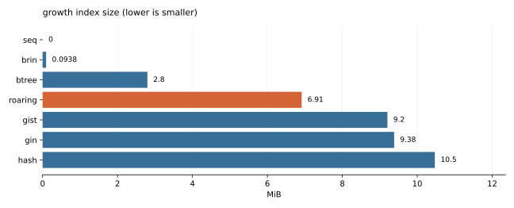
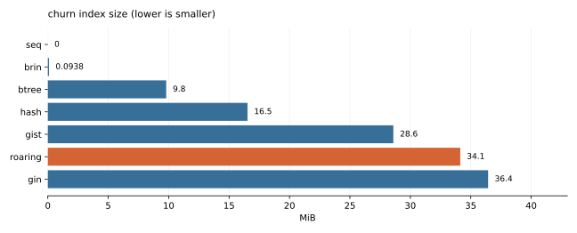
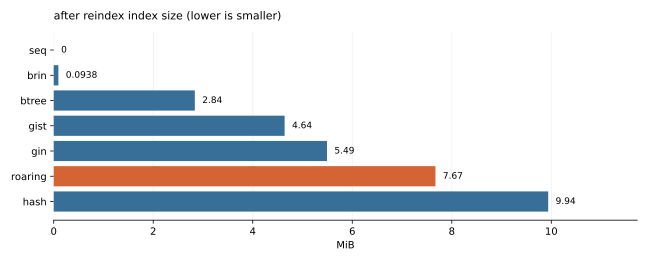

# Growth, churn, dirty memory, and concurrent-write supplement

Commit `7db8f11c0d311642d8b41bd598416694a860ad58`. Status: **complete**. Server: `PostgreSQL 20devel on x86_64-pc-linux-gnu, compiled by gcc (Ubuntu 13.3.0-6ubuntu2~24.04.1) 13.3.0, 64-bit`.

This complements the [main comparison](../2026-09-20-comparison/REPORT.md). It uses its own disposable cluster with the same durability, 512 MB shared buffers, default 64 MB work_mem, parallel-query/JIT disabling, and explicit vacuum policy. See [metadata.json](metadata.json) for arguments and settings, and [stress.jsonl](stress.jsonl) for every timing, full query plan, result-check status, and operation record. Families are shuffled with a fixed seed.

**Growth:** 100,000 rows with unique bigint `k`, two-valued integer `h`, and a 64-character payload; one index on each key. Compare bulk load followed by CREATE INDEX with CREATE INDEX on an empty table followed by the same insert. Insert timing includes index maintenance only in the second route. The sum of recorded load and populated-index build times excludes empty-index DDL and subsequent VACUUM; it is not total settled-construction cost, especially when GIN defers work into its pending list. Vacuum/ANALYZE precedes query timings and size collection, but its duration is not measured in this growth profile. This deliberately exposes fixed initial bucket sizing; it is not the main comparison's eight-index portfolio.

**Churn:** a separate, fixed-size table with the same two keys and no payload starts with a bulk build. Each of 5 cycles changes every unique key into a disjoint new range, then vacuums. The row count remains constant, while the historical key domain grows. After the last cycle, REINDEX measures reclaimable storage. Checkpoints precede updates, so their WAL includes full-page images. Observations are one per cycle and index family, not repeated trials of an identical state.

**Dirty memory:** after the bulk-built growth case, updating every payload clears visibility bits across populated pages. Counts/grouping run at 64 kB, 4 MB, and 64 MB work_mem with sequential scans discouraged. This exercises dirty candidates and lossy bitmaps; inspect the actual access route because a planner fallback remains possible. The separate `roaring_sql` diagnostic explicitly calls the direct SQL count function; for the two known groups it unions two such calls. It guarantees exercise of the count engine even when the planner prefers a bitmap scan. This is a specialized equivalent expression for this fixed two-valued dataset, not automatic arbitrary GROUP BY acceleration. Raw recheck statistics verify candidate counts. Every query, including that diagnostic, is compared as an exact result multiset against a forced sequential result before timing.

**Concurrent writes:** a new two-column table and one index on the two-valued `h` column for every client-count point. Closed-loop clients commit 100-row INSERT transactions for 3 seconds. Durability is enabled; no primary key or unique secondary index is present. The driver uses Python threads and synchronous libpq, so dispatch/parsing/result overhead is included. Every completed transaction is checked against the final row count. Faster methods insert more data during the fixed-duration burst; this is throughput under growth, not equal-sized end states. GIN uses its default fastupdate/pending-list behavior. The final VACUUM/drain time and WAL are reported separately, rather than treating deferred GIN work as free. Each client-count point is one short burst, with no between-run confidence interval; this is not a long-term saturation or replication test.

**Prepared queries:** after the bulk build, equality counts use explicitly typed parameters under `force_custom_plan` and `force_generic_plan`. Plans are prepared fresh after the sequential reference check and warmed before timing. Custom plans can substitute constants; a generic plan retains parameters and can lose roaring count pushdown. These two forced settings bracket the possibilities; the server's automatic custom/generic selection heuristic is not being simulated. Planning and execution times are both retained. The main comparison uses SQL literals.

Query medians, p95, and bootstrap intervals use the main report's method; they describe within-run variation. Build/insert/update/VACUUM durations use end-to-end wall time. No overall speedup is inferred by pooling unlike operations.

**250 successful query result checks; 2,500 timed queries.**

## Construction routes

[Download CSV](construction-routes.csv)

| Family | Load order | Insert ms | Build ms | Recorded load+build ms | Insert WAL MiB | Indexes MiB | Heap MiB |
| --- | --- | --- | --- | --- | --- | --- | --- |
| gin | bulk_then_index | 193.763 | 173.320 | 367.083 | 13.025 | 5.492 | 11.531 |
| gin | index_then_insert | 328.067 | 0.000 | 328.067 | 43.662 | 9.383 | 11.531 |
| hash | bulk_then_index | 134.529 | 726.511 | 861.039 | 13.025 | 9.938 | 11.531 |
| hash | index_then_insert | 981.063 | 0.000 | 981.063 | 29.780 | 10.469 | 11.531 |
| gist | bulk_then_index | 120.007 | 89.945 | 209.952 | 13.022 | 4.641 | 11.531 |
| gist | index_then_insert | 787.355 | 0.000 | 787.355 | 47.355 | 9.203 | 11.531 |
| brin | bulk_then_index | 129.717 | 21.906 | 151.623 | 13.021 | 0.094 | 11.531 |
| brin | index_then_insert | 145.711 | 0.000 | 145.711 | 13.179 | 0.094 | 11.531 |
| seq | bulk_then_index | 104.850 | 0.001 | 104.851 | 13.028 | 0.000 | 11.531 |
| seq | index_then_insert | 110.604 | 0.000 | 110.604 | 13.026 | 0.000 | 11.531 |
| btree | bulk_then_index | 114.344 | 55.809 | 170.153 | 13.023 | 2.836 | 11.531 |
| btree | index_then_insert | 304.058 | 0.000 | 304.058 | 25.545 | 2.797 | 11.531 |
| roaring | bulk_then_index | 117.590 | 350.967 | 468.558 | 13.028 | 7.812 | 11.531 |
| roaring | index_then_insert | 1191.573 | 0.000 | 1191.573 | 78.101 | 6.914 | 11.531 |

## Changing-key churn

[Download CSV](changing-key-churn.csv)

| Family | Cycle / state | Update ms | Update WAL MiB | Vacuum / reindex ms | Indexes MiB | Heap MiB |
| --- | --- | --- | --- | --- | --- | --- |
| gin | 0 | 0.000 | 0.000 | 0.000 | 5.492 | 4.531 |
| gin | 1 | 325.484 | 48.676 | 243.218 | 14.828 | 8.484 |
| gin | 2 | 291.673 | 48.659 | 240.913 | 20.305 | 8.484 |
| gin | 3 | 314.682 | 48.669 | 240.348 | 25.719 | 8.484 |
| gin | 4 | 292.861 | 48.662 | 245.218 | 31.102 | 8.484 |
| gin | 5 | 266.855 | 48.668 | 219.295 | 36.438 | 8.484 |
| gin | after REINDEX | 0.000 | 0.000 | 189.901 | 5.492 | 8.484 |
| hash | 0 | 0.000 | 0.000 | 0.000 | 9.938 | 4.531 |
| hash | 1 | 2415.925 | 34.398 | 45.810 | 16.469 | 8.484 |
| hash | 2 | 2356.577 | 33.788 | 49.612 | 16.523 | 8.484 |
| hash | 3 | 2359.129 | 33.795 | 50.559 | 16.523 | 8.484 |
| hash | 4 | 2284.689 | 33.790 | 49.888 | 16.523 | 8.484 |
| hash | 5 | 2310.017 | 33.796 | 52.761 | 16.523 | 8.484 |
| hash | after REINDEX | 0.000 | 0.000 | 699.442 | 9.938 | 8.484 |
| gist | 0 | 0.000 | 0.000 | 0.000 | 4.641 | 4.531 |
| gist | 1 | 995.862 | 57.211 | 37.146 | 15.688 | 8.484 |
| gist | 2 | 959.109 | 55.892 | 39.676 | 24.023 | 8.484 |
| gist | 3 | 905.009 | 57.191 | 37.830 | 28.461 | 8.484 |
| gist | 4 | 879.707 | 56.418 | 38.580 | 28.516 | 8.484 |
| gist | 5 | 901.879 | 56.759 | 47.568 | 28.594 | 8.484 |
| gist | after REINDEX | 0.000 | 0.000 | 116.775 | 4.641 | 8.484 |
| brin | 0 | 0.000 | 0.000 | 0.000 | 0.094 | 4.531 |
| brin | 1 | 171.867 | 18.497 | 49.434 | 0.094 | 8.484 |
| brin | 2 | 258.137 | 24.896 | 35.172 | 0.094 | 8.484 |
| brin | 3 | 252.698 | 24.588 | 34.106 | 0.094 | 8.484 |
| brin | 4 | 272.765 | 24.894 | 34.835 | 0.094 | 8.484 |
| brin | 5 | 268.384 | 24.589 | 34.279 | 0.094 | 8.484 |
| brin | after REINDEX | 0.000 | 0.000 | 19.265 | 0.094 | 8.484 |
| seq | 0 | 0.000 | 0.000 | 0.000 | 0.000 | 4.531 |
| seq | 1 | 117.979 | 18.044 | 26.401 | 0.000 | 8.484 |
| seq | 2 | 119.977 | 18.010 | 34.474 | 0.000 | 8.484 |
| seq | 3 | 123.168 | 18.020 | 31.031 | 0.000 | 8.484 |
| seq | 4 | 119.312 | 18.014 | 29.090 | 0.000 | 8.484 |
| seq | 5 | 109.573 | 18.020 | 28.821 | 0.000 | 8.484 |
| seq | after REINDEX | 0.000 | 0.000 | 0.171 | 0.000 | 8.484 |
| btree | 0 | 0.000 | 0.000 | 0.000 | 2.836 | 4.531 |
| btree | 1 | 354.519 | 30.666 | 36.688 | 5.625 | 8.484 |
| btree | 2 | 401.749 | 31.884 | 39.103 | 8.984 | 8.484 |
| btree | 3 | 356.119 | 31.104 | 45.155 | 9.266 | 8.484 |
| btree | 4 | 376.772 | 31.350 | 38.667 | 9.797 | 8.484 |
| btree | 5 | 346.357 | 31.135 | 41.186 | 9.797 | 8.484 |
| btree | after REINDEX | 0.000 | 0.000 | 56.338 | 2.836 | 8.484 |
| roaring | 0 | 0.000 | 0.000 | 0.000 | 7.594 | 4.531 |
| roaring | 1 | 867.497 | 58.117 | 1268.056 | 14.117 | 8.484 |
| roaring | 2 | 1031.950 | 62.699 | 1170.907 | 20.750 | 8.484 |
| roaring | 3 | 1039.293 | 67.882 | 974.159 | 24.617 | 8.484 |
| roaring | 4 | 1211.086 | 71.080 | 914.423 | 27.703 | 8.484 |
| roaring | 5 | 1228.464 | 75.810 | 1017.270 | 34.133 | 8.484 |
| roaring | after REINDEX | 0.000 | 0.000 | 391.522 | 7.672 | 8.484 |

## Concurrent inserts

[Download CSV](concurrent-inserts.csv)

| Family | Clients | Rows inserted | Transactions/s | Median ms | p95 ms | WAL MiB | Indexes MiB | Drain ms | Drain WAL MiB |
| --- | --- | --- | --- | --- | --- | --- | --- | --- | --- |
| gin | 1 | 153900 | 512.9 | 1.717 | 2.646 | 34.305 | 2.969 | 25.057 | 0.370 |
| gin | 4 | 341400 | 1136.6 | 3.673 | 4.500 | 76.676 | 4.406 | 41.667 | 0.190 |
| gin | 8 | 468900 | 1561.7 | 5.005 | 8.061 | 105.303 | 4.547 | 46.447 | 0.234 |
| hash | 1 | 111300 | 370.6 | 2.610 | 3.783 | 17.683 | 6.875 | 19.206 | 0.031 |
| hash | 4 | 233000 | 774.9 | 4.910 | 8.088 | 34.686 | 10.484 | 26.869 | 0.009 |
| hash | 8 | 308300 | 1024.2 | 7.840 | 11.009 | 48.015 | 15.445 | 26.529 | 0.010 |
| gist | 1 | 146000 | 486.4 | 1.835 | 2.799 | 24.758 | 5.586 | 20.088 | 0.032 |
| gist | 4 | 346200 | 1153.4 | 3.635 | 4.090 | 58.718 | 13.234 | 30.149 | 0.009 |
| gist | 8 | 679000 | 2260.9 | 3.546 | 4.840 | 115.115 | 25.930 | 39.062 | 0.011 |
| brin | 1 | 149400 | 497.9 | 1.806 | 2.821 | 10.421 | 0.047 | 33.357 | 0.043 |
| brin | 4 | 355800 | 1184.7 | 3.552 | 3.941 | 24.801 | 0.047 | 59.549 | 0.026 |
| brin | 8 | 716700 | 2387.1 | 3.447 | 3.970 | 49.915 | 0.047 | 102.622 | 0.035 |
| seq | 1 | 171800 | 572.5 | 1.542 | 2.373 | 11.968 | 0.000 | 19.402 | 0.032 |
| seq | 4 | 363300 | 1210.3 | 3.381 | 3.888 | 25.317 | 0.000 | 30.139 | 0.010 |
| seq | 8 | 700300 | 2332.7 | 3.510 | 4.191 | 48.761 | 0.000 | 37.860 | 0.011 |
| btree | 1 | 152700 | 508.6 | 1.745 | 2.706 | 20.105 | 0.953 | 19.571 | 0.030 |
| btree | 4 | 358300 | 1193.1 | 3.612 | 3.860 | 48.625 | 3.750 | 30.266 | 0.007 |
| btree | 8 | 489400 | 1629.1 | 4.776 | 8.023 | 66.977 | 4.836 | 32.575 | 0.009 |
| roaring | 1 | 136500 | 454.8 | 1.983 | 2.915 | 43.256 | 0.695 | 19.772 | 0.029 |
| roaring | 4 | 219600 | 731.6 | 5.422 | 8.563 | 74.798 | 0.805 | 25.927 | 0.007 |
| roaring | 8 | 253900 | 844.8 | 9.400 | 13.476 | 94.212 | 0.852 | 26.962 | 0.008 |

## Roaring storage structure

[Download CSV](roaring-storage-structure.csv)

| Profile | State | Index | Buckets | Bucket pages | Entries | Container pages | TIDs |
| --- | --- | --- | --- | --- | --- | --- | --- |
| growth | bulk_then_index | fact_k_idx | 847 | 888 | 100000 | 0 | 100000 |
| growth | bulk_then_index | fact_h_idx | 64 | 64 | 2 | 46 | 100000 |
| growth | index_then_insert | fact_k_idx | 64 | 773 | 100000 | 0 | 100000 |
| growth | index_then_insert | fact_h_idx | 64 | 64 | 2 | 46 | 100000 |
| churn | cycle 0 | fact_k_idx | 847 | 888 | 100000 | 0 | 100000 |
| churn | cycle 0 | fact_h_idx | 64 | 64 | 2 | 18 | 100000 |
| churn | cycle 1 | fact_k_idx | 847 | 1707 | 200000 | 0 | 100000 |
| churn | cycle 1 | fact_h_idx | 64 | 64 | 2 | 34 | 100000 |
| churn | cycle 2 | fact_k_idx | 847 | 2540 | 300000 | 0 | 100000 |
| churn | cycle 2 | fact_h_idx | 64 | 64 | 2 | 50 | 100000 |
| churn | cycle 3 | fact_k_idx | 847 | 3021 | 400000 | 0 | 100000 |
| churn | cycle 3 | fact_h_idx | 64 | 64 | 2 | 64 | 100000 |
| churn | cycle 4 | fact_k_idx | 847 | 3400 | 500000 | 0 | 100000 |
| churn | cycle 4 | fact_h_idx | 64 | 64 | 2 | 80 | 100000 |
| churn | cycle 5 | fact_k_idx | 847 | 4209 | 600000 | 0 | 100000 |
| churn | cycle 5 | fact_h_idx | 64 | 64 | 2 | 94 | 100000 |
| after_reindex | cycle 5 | fact_k_idx | 847 | 898 | 100000 | 0 | 100000 |
| after_reindex | cycle 5 | fact_h_idx | 64 | 64 | 2 | 18 | 100000 |

## Every measured query

[Download CSV](every-measured-query.csv)

| Profile | Variant | State | Query | n | Execution median ms | 95% CI ms | p95 ms | Access | Lossy heap blocks (max) | Planning median ms | Plan+execution median ms |
| --- | --- | --- | --- | --- | --- | --- | --- | --- | --- | --- | --- |
| churn | brin | cycle 1 | dense | 10 | 4.859 | 4.816–4.917 | 4.929 | Seq Scan | 0 | 0.026 | 4.886 |
| churn | brin | cycle 1 | obsolete | 10 | 0.288 | 0.283–0.304 | 0.313 | Bitmap Heap Scan, Bitmap Index Scan | 58 | 0.030 | 0.324 |
| churn | brin | cycle 1 | point | 10 | 0.611 | 0.595–0.627 | 0.647 | Bitmap Heap Scan, Bitmap Index Scan | 58 | 0.030 | 0.638 |
| churn | brin | cycle 2 | dense | 10 | 4.907 | 4.802–4.993 | 5.212 | Seq Scan | 0 | 0.030 | 4.947 |
| churn | brin | cycle 2 | obsolete | 10 | 2.997 | 2.953–3.100 | 3.208 | Bitmap Heap Scan, Bitmap Index Scan | 314 | 0.031 | 3.026 |
| churn | brin | cycle 2 | point | 10 | 3.002 | 2.953–3.093 | 3.117 | Bitmap Heap Scan, Bitmap Index Scan | 314 | 0.030 | 3.044 |
| churn | brin | cycle 3 | dense | 10 | 4.801 | 4.696–4.898 | 4.949 | Seq Scan | 0 | 0.029 | 4.830 |
| churn | brin | cycle 3 | obsolete | 10 | 0.322 | 0.318–0.342 | 0.377 | Bitmap Heap Scan, Bitmap Index Scan | 314 | 0.031 | 0.353 |
| churn | brin | cycle 3 | point | 10 | 2.877 | 2.846–2.905 | 2.975 | Bitmap Heap Scan, Bitmap Index Scan | 282 | 0.031 | 2.909 |
| churn | brin | cycle 4 | dense | 10 | 4.815 | 4.753–4.928 | 5.173 | Seq Scan | 0 | 0.029 | 4.845 |
| churn | brin | cycle 4 | obsolete | 10 | 2.928 | 2.890–3.001 | 3.055 | Bitmap Heap Scan, Bitmap Index Scan | 314 | 0.031 | 2.959 |
| churn | brin | cycle 4 | point | 10 | 2.889 | 2.857–2.998 | 3.090 | Bitmap Heap Scan, Bitmap Index Scan | 314 | 0.032 | 2.921 |
| churn | brin | cycle 5 | dense | 10 | 4.912 | 4.847–5.117 | 5.497 | Seq Scan | 0 | 0.029 | 4.939 |
| churn | brin | cycle 5 | obsolete | 10 | 0.349 | 0.330–0.364 | 0.375 | Bitmap Heap Scan, Bitmap Index Scan | 314 | 0.031 | 0.380 |
| churn | brin | cycle 5 | point | 10 | 2.926 | 2.879–2.990 | 3.036 | Bitmap Heap Scan, Bitmap Index Scan | 282 | 0.029 | 2.955 |
| churn | btree | cycle 1 | dense | 10 | 2.915 | 2.888–2.995 | 3.082 | Index Only Scan | 0 | 0.026 | 2.942 |
| churn | btree | cycle 1 | obsolete | 10 | 0.014 | 0.014–0.015 | 0.015 | Index Only Scan | 0 | 0.029 | 0.043 |
| churn | btree | cycle 1 | point | 10 | 0.015 | 0.014–0.016 | 0.018 | Index Only Scan | 0 | 0.028 | 0.042 |
| churn | btree | cycle 2 | dense | 10 | 2.938 | 2.918–2.972 | 3.368 | Index Only Scan | 0 | 0.027 | 2.965 |
| churn | btree | cycle 2 | obsolete | 10 | 0.014 | 0.014–0.015 | 0.016 | Index Only Scan | 0 | 0.029 | 0.043 |
| churn | btree | cycle 2 | point | 10 | 0.015 | 0.015–0.017 | 0.017 | Index Only Scan | 0 | 0.029 | 0.044 |
| churn | btree | cycle 3 | dense | 10 | 3.060 | 2.974–3.107 | 3.147 | Index Only Scan | 0 | 0.026 | 3.088 |
| churn | btree | cycle 3 | obsolete | 10 | 0.014 | 0.014–0.014 | 0.016 | Index Only Scan | 0 | 0.028 | 0.042 |
| churn | btree | cycle 3 | point | 10 | 0.016 | 0.015–0.017 | 0.018 | Index Only Scan | 0 | 0.029 | 0.045 |
| churn | btree | cycle 4 | dense | 10 | 2.954 | 2.923–3.069 | 3.138 | Index Only Scan | 0 | 0.026 | 2.981 |
| churn | btree | cycle 4 | obsolete | 10 | 0.014 | 0.014–0.015 | 0.016 | Index Only Scan | 0 | 0.031 | 0.045 |
| churn | btree | cycle 4 | point | 10 | 0.016 | 0.015–0.017 | 0.017 | Index Only Scan | 0 | 0.030 | 0.046 |
| churn | btree | cycle 5 | dense | 10 | 2.991 | 2.918–3.092 | 3.946 | Index Only Scan | 0 | 0.026 | 3.018 |
| churn | btree | cycle 5 | obsolete | 10 | 0.015 | 0.014–0.015 | 0.018 | Index Only Scan | 0 | 0.030 | 0.045 |
| churn | btree | cycle 5 | point | 10 | 0.017 | 0.015–0.018 | 0.019 | Index Only Scan | 0 | 0.029 | 0.046 |
| churn | gin | cycle 1 | dense | 10 | 6.809 | 6.688–6.925 | 7.160 | Bitmap Heap Scan, Bitmap Index Scan | 0 | 0.028 | 6.835 |
| churn | gin | cycle 1 | obsolete | 10 | 0.017 | 0.016–0.018 | 0.024 | Bitmap Heap Scan, Bitmap Index Scan | 0 | 0.032 | 0.049 |
| churn | gin | cycle 1 | point | 10 | 0.019 | 0.019–0.020 | 0.024 | Bitmap Heap Scan, Bitmap Index Scan | 0 | 0.032 | 0.051 |
| churn | gin | cycle 2 | dense | 10 | 6.575 | 6.465–7.234 | 9.294 | Bitmap Heap Scan, Bitmap Index Scan | 0 | 0.032 | 6.604 |
| churn | gin | cycle 2 | obsolete | 10 | 0.018 | 0.017–0.019 | 0.027 | Bitmap Heap Scan, Bitmap Index Scan | 0 | 0.033 | 0.051 |
| churn | gin | cycle 2 | point | 10 | 0.020 | 0.019–0.021 | 0.041 | Bitmap Heap Scan, Bitmap Index Scan | 0 | 0.033 | 0.053 |
| churn | gin | cycle 3 | dense | 10 | 6.657 | 6.517–6.736 | 7.114 | Bitmap Heap Scan, Bitmap Index Scan | 0 | 0.028 | 6.684 |
| churn | gin | cycle 3 | obsolete | 10 | 0.017 | 0.016–0.018 | 0.019 | Bitmap Heap Scan, Bitmap Index Scan | 0 | 0.031 | 0.048 |
| churn | gin | cycle 3 | point | 10 | 0.019 | 0.019–0.021 | 0.039 | Bitmap Heap Scan, Bitmap Index Scan | 0 | 0.032 | 0.052 |
| churn | gin | cycle 4 | dense | 10 | 6.404 | 6.361–6.638 | 7.266 | Bitmap Heap Scan, Bitmap Index Scan | 0 | 0.029 | 6.431 |
| churn | gin | cycle 4 | obsolete | 10 | 0.018 | 0.017–0.018 | 0.034 | Bitmap Heap Scan, Bitmap Index Scan | 0 | 0.033 | 0.052 |
| churn | gin | cycle 4 | point | 10 | 0.019 | 0.019–0.021 | 0.026 | Bitmap Heap Scan, Bitmap Index Scan | 0 | 0.032 | 0.051 |
| churn | gin | cycle 5 | dense | 10 | 6.549 | 6.368–6.906 | 7.548 | Bitmap Heap Scan, Bitmap Index Scan | 0 | 0.029 | 6.579 |
| churn | gin | cycle 5 | obsolete | 10 | 0.017 | 0.017–0.018 | 0.020 | Bitmap Heap Scan, Bitmap Index Scan | 0 | 0.033 | 0.050 |
| churn | gin | cycle 5 | point | 10 | 0.020 | 0.019–0.025 | 0.034 | Bitmap Heap Scan, Bitmap Index Scan | 0 | 0.031 | 0.053 |
| churn | gist | cycle 1 | dense | 10 | 4.774 | 4.743–4.906 | 5.119 | Seq Scan | 0 | 0.025 | 4.801 |
| churn | gist | cycle 1 | obsolete | 10 | 0.017 | 0.015–0.018 | 0.019 | Index Only Scan | 0 | 0.031 | 0.048 |
| churn | gist | cycle 1 | point | 10 | 0.025 | 0.023–0.029 | 0.036 | Index Only Scan | 0 | 0.029 | 0.054 |
| churn | gist | cycle 2 | dense | 10 | 4.739 | 4.677–4.792 | 5.146 | Seq Scan | 0 | 0.029 | 4.772 |
| churn | gist | cycle 2 | obsolete | 10 | 0.017 | 0.016–0.017 | 0.017 | Index Only Scan | 0 | 0.031 | 0.048 |
| churn | gist | cycle 2 | point | 10 | 0.024 | 0.023–0.025 | 0.030 | Index Only Scan | 0 | 0.030 | 0.054 |
| churn | gist | cycle 3 | dense | 10 | 4.834 | 4.777–4.890 | 4.900 | Seq Scan | 0 | 0.025 | 4.858 |
| churn | gist | cycle 3 | obsolete | 10 | 0.015 | 0.014–0.016 | 0.023 | Index Only Scan | 0 | 0.028 | 0.042 |
| churn | gist | cycle 3 | point | 10 | 0.023 | 0.022–0.025 | 0.025 | Index Only Scan | 0 | 0.029 | 0.052 |
| churn | gist | cycle 4 | dense | 10 | 4.792 | 4.718–5.154 | 5.897 | Seq Scan | 0 | 0.025 | 4.821 |
| churn | gist | cycle 4 | obsolete | 10 | 0.017 | 0.015–0.017 | 0.017 | Index Only Scan | 0 | 0.031 | 0.048 |
| churn | gist | cycle 4 | point | 10 | 0.023 | 0.022–0.032 | 0.050 | Index Only Scan | 0 | 0.027 | 0.051 |
| churn | gist | cycle 5 | dense | 10 | 4.800 | 4.771–4.883 | 5.014 | Seq Scan | 0 | 0.028 | 4.827 |
| churn | gist | cycle 5 | obsolete | 10 | 0.016 | 0.016–0.017 | 0.017 | Index Only Scan | 0 | 0.030 | 0.046 |
| churn | gist | cycle 5 | point | 10 | 0.024 | 0.023–0.025 | 0.025 | Index Only Scan | 0 | 0.030 | 0.054 |
| churn | hash | cycle 1 | dense | 10 | 4.740 | 4.679–4.809 | 5.471 | Seq Scan | 0 | 0.024 | 4.765 |
| churn | hash | cycle 1 | obsolete | 10 | 0.012 | 0.012–0.014 | 0.015 | Index Scan | 0 | 0.028 | 0.040 |
| churn | hash | cycle 1 | point | 10 | 0.014 | 0.013–0.015 | 0.016 | Index Scan | 0 | 0.028 | 0.042 |
| churn | hash | cycle 2 | dense | 10 | 4.957 | 4.780–5.638 | 6.206 | Seq Scan | 0 | 0.028 | 4.983 |
| churn | hash | cycle 2 | obsolete | 10 | 0.013 | 0.012–0.014 | 0.033 | Index Scan | 0 | 0.029 | 0.042 |
| churn | hash | cycle 2 | point | 10 | 0.015 | 0.014–0.016 | 0.019 | Index Scan | 0 | 0.030 | 0.045 |
| churn | hash | cycle 3 | dense | 10 | 4.788 | 4.734–4.895 | 5.038 | Seq Scan | 0 | 0.024 | 4.812 |
| churn | hash | cycle 3 | obsolete | 10 | 0.013 | 0.012–0.013 | 0.015 | Index Scan | 0 | 0.029 | 0.042 |
| churn | hash | cycle 3 | point | 10 | 0.014 | 0.013–0.015 | 0.016 | Index Scan | 0 | 0.027 | 0.041 |
| churn | hash | cycle 4 | dense | 10 | 4.816 | 4.758–5.281 | 5.647 | Seq Scan | 0 | 0.027 | 4.844 |
| churn | hash | cycle 4 | obsolete | 10 | 0.013 | 0.012–0.014 | 0.033 | Index Scan | 0 | 0.030 | 0.043 |
| churn | hash | cycle 4 | point | 10 | 0.015 | 0.015–0.018 | 0.021 | Index Scan | 0 | 0.030 | 0.046 |
| churn | hash | cycle 5 | dense | 10 | 4.756 | 4.716–4.816 | 4.835 | Seq Scan | 0 | 0.026 | 4.782 |
| churn | hash | cycle 5 | obsolete | 10 | 0.013 | 0.012–0.013 | 0.013 | Index Scan | 0 | 0.028 | 0.041 |
| churn | hash | cycle 5 | point | 10 | 0.014 | 0.014–0.015 | 0.019 | Index Scan | 0 | 0.028 | 0.042 |
| churn | roaring | cycle 1 | dense | 10 | 0.021 | 0.018–0.021 | 0.022 | RoaringCount | 0 | 0.028 | 0.049 |
| churn | roaring | cycle 1 | obsolete | 10 | 0.008 | 0.007–0.009 | 0.009 | RoaringCount | 0 | 0.029 | 0.037 |
| churn | roaring | cycle 1 | point | 10 | 0.009 | 0.009–0.011 | 0.012 | RoaringCount | 0 | 0.029 | 0.038 |
| churn | roaring | cycle 2 | dense | 10 | 0.023 | 0.023–0.027 | 0.028 | RoaringCount | 0 | 0.028 | 0.051 |
| churn | roaring | cycle 2 | obsolete | 10 | 0.008 | 0.008–0.009 | 0.010 | RoaringCount | 0 | 0.029 | 0.037 |
| churn | roaring | cycle 2 | point | 10 | 0.010 | 0.009–0.011 | 0.012 | RoaringCount | 0 | 0.029 | 0.040 |
| churn | roaring | cycle 3 | dense | 10 | 0.030 | 0.026–0.032 | 0.039 | RoaringCount | 0 | 0.030 | 0.060 |
| churn | roaring | cycle 3 | obsolete | 10 | 0.008 | 0.007–0.009 | 0.010 | RoaringCount | 0 | 0.029 | 0.037 |
| churn | roaring | cycle 3 | point | 10 | 0.010 | 0.010–0.012 | 0.021 | RoaringCount | 0 | 0.029 | 0.040 |
| churn | roaring | cycle 4 | dense | 10 | 0.036 | 0.035–0.037 | 0.048 | RoaringCount | 0 | 0.032 | 0.069 |
| churn | roaring | cycle 4 | obsolete | 10 | 0.009 | 0.008–0.009 | 0.025 | RoaringCount | 0 | 0.033 | 0.042 |
| churn | roaring | cycle 4 | point | 10 | 0.012 | 0.011–0.012 | 0.013 | RoaringCount | 0 | 0.033 | 0.044 |
| churn | roaring | cycle 5 | dense | 10 | 0.041 | 0.037–0.048 | 0.052 | RoaringCount | 0 | 0.029 | 0.071 |
| churn | roaring | cycle 5 | obsolete | 10 | 0.009 | 0.008–0.009 | 0.011 | RoaringCount | 0 | 0.033 | 0.043 |
| churn | roaring | cycle 5 | point | 10 | 0.011 | 0.010–0.012 | 0.013 | RoaringCount | 0 | 0.029 | 0.040 |
| churn | roaring_bitmap | cycle 1 | dense | 10 | 3.922 | 3.899–4.019 | 4.376 | Bitmap Heap Scan, Bitmap Index Scan | 0 | 0.025 | 3.949 |
| churn | roaring_bitmap | cycle 1 | obsolete | 10 | 0.014 | 0.014–0.015 | 0.017 | Bitmap Heap Scan, Bitmap Index Scan | 0 | 0.026 | 0.041 |
| churn | roaring_bitmap | cycle 1 | point | 10 | 0.017 | 0.017–0.018 | 0.028 | Bitmap Heap Scan, Bitmap Index Scan | 0 | 0.027 | 0.044 |
| churn | roaring_bitmap | cycle 2 | dense | 10 | 4.725 | 4.679–4.769 | 4.950 | Seq Scan | 0 | 0.024 | 4.751 |
| churn | roaring_bitmap | cycle 2 | obsolete | 10 | 0.014 | 0.014–0.015 | 0.016 | Bitmap Heap Scan, Bitmap Index Scan | 0 | 0.028 | 0.042 |
| churn | roaring_bitmap | cycle 2 | point | 10 | 0.018 | 0.017–0.019 | 0.020 | Bitmap Heap Scan, Bitmap Index Scan | 0 | 0.028 | 0.045 |
| churn | roaring_bitmap | cycle 3 | dense | 10 | 4.707 | 4.657–4.796 | 4.873 | Seq Scan | 0 | 0.024 | 4.732 |
| churn | roaring_bitmap | cycle 3 | obsolete | 10 | 0.014 | 0.014–0.015 | 0.015 | Bitmap Heap Scan, Bitmap Index Scan | 0 | 0.028 | 0.042 |
| churn | roaring_bitmap | cycle 3 | point | 10 | 0.018 | 0.018–0.019 | 0.020 | Bitmap Heap Scan, Bitmap Index Scan | 0 | 0.028 | 0.046 |
| churn | roaring_bitmap | cycle 4 | dense | 10 | 4.879 | 4.757–5.277 | 6.335 | Seq Scan | 0 | 0.026 | 4.904 |
| churn | roaring_bitmap | cycle 4 | obsolete | 10 | 0.015 | 0.014–0.016 | 0.038 | Bitmap Heap Scan, Bitmap Index Scan | 0 | 0.029 | 0.044 |
| churn | roaring_bitmap | cycle 4 | point | 10 | 0.020 | 0.019–0.021 | 0.022 | Bitmap Heap Scan, Bitmap Index Scan | 0 | 0.029 | 0.049 |
| churn | roaring_bitmap | cycle 5 | dense | 10 | 4.724 | 4.678–4.782 | 5.071 | Seq Scan | 0 | 0.025 | 4.750 |
| churn | roaring_bitmap | cycle 5 | obsolete | 10 | 0.014 | 0.013–0.015 | 0.016 | Bitmap Heap Scan, Bitmap Index Scan | 0 | 0.026 | 0.041 |
| churn | roaring_bitmap | cycle 5 | point | 10 | 0.019 | 0.017–0.019 | 0.039 | Bitmap Heap Scan, Bitmap Index Scan | 0 | 0.026 | 0.045 |
| churn | seq | cycle 1 | dense | 10 | 4.860 | 4.804–4.968 | 7.009 | Seq Scan | 0 | 0.021 | 4.899 |
| churn | seq | cycle 1 | obsolete | 10 | 3.156 | 3.080–3.216 | 3.236 | Seq Scan | 0 | 0.023 | 3.179 |
| churn | seq | cycle 1 | point | 10 | 3.169 | 3.127–3.207 | 3.321 | Seq Scan | 0 | 0.023 | 3.192 |
| churn | seq | cycle 2 | dense | 10 | 4.702 | 4.684–4.916 | 5.828 | Seq Scan | 0 | 0.020 | 4.723 |
| churn | seq | cycle 2 | obsolete | 10 | 3.093 | 3.063–3.165 | 3.174 | Seq Scan | 0 | 0.021 | 3.117 |
| churn | seq | cycle 2 | point | 10 | 3.090 | 3.066–3.167 | 3.269 | Seq Scan | 0 | 0.023 | 3.112 |
| churn | seq | cycle 3 | dense | 10 | 4.686 | 4.652–4.703 | 4.717 | Seq Scan | 0 | 0.021 | 4.707 |
| churn | seq | cycle 3 | obsolete | 10 | 3.064 | 3.040–3.098 | 3.696 | Seq Scan | 0 | 0.022 | 3.087 |
| churn | seq | cycle 3 | point | 10 | 3.081 | 3.069–3.091 | 3.097 | Seq Scan | 0 | 0.022 | 3.106 |
| churn | seq | cycle 4 | dense | 10 | 4.946 | 4.829–5.149 | 5.582 | Seq Scan | 0 | 0.021 | 4.965 |
| churn | seq | cycle 4 | obsolete | 10 | 3.157 | 3.103–3.214 | 3.223 | Seq Scan | 0 | 0.023 | 3.179 |
| churn | seq | cycle 4 | point | 10 | 3.179 | 3.146–3.202 | 3.220 | Seq Scan | 0 | 0.022 | 3.202 |
| churn | seq | cycle 5 | dense | 10 | 4.862 | 4.805–5.004 | 5.125 | Seq Scan | 0 | 0.021 | 4.883 |
| churn | seq | cycle 5 | obsolete | 10 | 3.177 | 3.150–3.298 | 3.489 | Seq Scan | 0 | 0.023 | 3.199 |
| churn | seq | cycle 5 | point | 10 | 3.229 | 3.187–3.283 | 3.321 | Seq Scan | 0 | 0.023 | 3.252 |
| dirty_memory | brin | 4MB | dense | 10 | 7.735 | 7.581–7.826 | 7.917 | Bitmap Heap Scan, Bitmap Index Scan | 2790 | 0.029 | 7.763 |
| dirty_memory | brin | 4MB | group | 10 | 12.430 | 12.272–13.045 | 15.917 | Seq Scan | 0 | 0.026 | 12.456 |
| dirty_memory | brin | 64MB | dense | 10 | 7.963 | 7.676–8.382 | 9.298 | Bitmap Heap Scan, Bitmap Index Scan | 2790 | 0.029 | 7.992 |
| dirty_memory | brin | 64MB | group | 10 | 12.726 | 12.172–12.999 | 13.084 | Seq Scan | 0 | 0.026 | 12.753 |
| dirty_memory | brin | 64kB | dense | 10 | 7.797 | 7.740–7.873 | 7.874 | Bitmap Heap Scan, Bitmap Index Scan | 2790 | 0.029 | 7.830 |
| dirty_memory | brin | 64kB | group | 10 | 12.401 | 12.359–12.801 | 13.334 | Seq Scan | 0 | 0.025 | 12.425 |
| dirty_memory | btree | 4MB | dense | 10 | 6.731 | 6.643–6.793 | 6.832 | Bitmap Heap Scan, Bitmap Index Scan | 0 | 0.030 | 6.761 |
| dirty_memory | btree | 4MB | group | 10 | 16.846 | 16.522–17.292 | 19.058 | Index Only Scan | 0 | 0.030 | 16.886 |
| dirty_memory | btree | 64MB | dense | 10 | 6.707 | 6.609–6.793 | 6.983 | Bitmap Heap Scan, Bitmap Index Scan | 0 | 0.030 | 6.736 |
| dirty_memory | btree | 64MB | group | 10 | 16.950 | 16.617–18.324 | 21.119 | Index Only Scan | 0 | 0.030 | 16.980 |
| dirty_memory | btree | 64kB | dense | 10 | 8.171 | 8.002–8.397 | 8.734 | Bitmap Heap Scan, Bitmap Index Scan | 2062 | 0.029 | 8.199 |
| dirty_memory | btree | 64kB | group | 10 | 16.748 | 16.275–17.703 | 18.342 | Index Only Scan | 0 | 0.030 | 16.780 |
| dirty_memory | gin | 4MB | dense | 10 | 11.954 | 11.867–13.844 | 15.558 | Bitmap Heap Scan, Bitmap Index Scan | 0 | 0.031 | 11.985 |
| dirty_memory | gin | 4MB | group | 10 | 12.796 | 12.506–13.430 | 14.407 | Seq Scan | 0 | 0.026 | 12.835 |
| dirty_memory | gin | 64MB | dense | 10 | 12.350 | 12.045–12.829 | 13.327 | Bitmap Heap Scan, Bitmap Index Scan | 0 | 0.032 | 12.391 |
| dirty_memory | gin | 64MB | group | 10 | 12.585 | 12.285–13.132 | 14.268 | Seq Scan | 0 | 0.026 | 12.609 |
| dirty_memory | gin | 64kB | dense | 10 | 15.425 | 14.997–15.998 | 17.458 | Bitmap Heap Scan, Bitmap Index Scan | 2064 | 0.033 | 15.459 |
| dirty_memory | gin | 64kB | group | 10 | 12.845 | 12.675–13.085 | 13.666 | Seq Scan | 0 | 0.027 | 12.877 |
| dirty_memory | gist | 4MB | dense | 10 | 8.797 | 8.747–9.940 | 11.886 | Bitmap Heap Scan, Bitmap Index Scan | 0 | 0.030 | 8.827 |
| dirty_memory | gist | 4MB | group | 10 | 20.312 | 19.827–21.007 | 22.388 | Bitmap Heap Scan, Bitmap Index Scan | 0 | 0.029 | 20.342 |
| dirty_memory | gist | 64MB | dense | 10 | 8.948 | 8.891–9.046 | 9.257 | Bitmap Heap Scan, Bitmap Index Scan | 0 | 0.029 | 8.978 |
| dirty_memory | gist | 64MB | group | 10 | 20.323 | 19.534–21.286 | 24.366 | Bitmap Heap Scan, Bitmap Index Scan | 0 | 0.029 | 20.352 |
| dirty_memory | gist | 64kB | dense | 10 | 11.441 | 11.309–11.835 | 13.330 | Bitmap Heap Scan, Bitmap Index Scan | 2070 | 0.031 | 11.474 |
| dirty_memory | gist | 64kB | group | 10 | 19.050 | 18.492–19.444 | 19.721 | Bitmap Heap Scan, Bitmap Index Scan | 2070 | 0.029 | 19.081 |
| dirty_memory | hash | 4MB | dense | 10 | 8.380 | 8.312–8.575 | 8.585 | Bitmap Heap Scan, Bitmap Index Scan | 0 | 0.027 | 8.408 |
| dirty_memory | hash | 4MB | group | 10 | 12.241 | 12.171–12.639 | 12.752 | Seq Scan | 0 | 0.024 | 12.275 |
| dirty_memory | hash | 64MB | dense | 10 | 8.543 | 8.466–8.616 | 8.711 | Bitmap Heap Scan, Bitmap Index Scan | 0 | 0.028 | 8.576 |
| dirty_memory | hash | 64MB | group | 10 | 12.652 | 12.346–13.110 | 13.402 | Seq Scan | 0 | 0.026 | 12.683 |
| dirty_memory | hash | 64kB | dense | 10 | 8.972 | 8.922–9.113 | 13.202 | Bitmap Heap Scan, Bitmap Index Scan | 2063 | 0.027 | 9.000 |
| dirty_memory | hash | 64kB | group | 10 | 12.270 | 12.187–12.583 | 13.332 | Seq Scan | 0 | 0.026 | 12.312 |
| dirty_memory | roaring | 4MB | dense | 10 | 5.829 | 5.770–5.853 | 5.873 | Bitmap Heap Scan, Bitmap Index Scan | 0 | 0.033 | 5.862 |
| dirty_memory | roaring | 4MB | group | 10 | 5.456 | 5.383–5.522 | 5.587 | RoaringCount | 0 | 0.029 | 5.486 |
| dirty_memory | roaring | 64MB | dense | 10 | 5.928 | 5.866–5.968 | 6.402 | Bitmap Heap Scan, Bitmap Index Scan | 0 | 0.033 | 5.960 |
| dirty_memory | roaring | 64MB | group | 10 | 5.441 | 5.383–5.972 | 6.564 | RoaringCount | 0 | 0.029 | 5.470 |
| dirty_memory | roaring | 64kB | dense | 10 | 7.226 | 7.171–7.309 | 7.846 | Bitmap Heap Scan, Bitmap Index Scan | 2062 | 0.033 | 7.259 |
| dirty_memory | roaring | 64kB | group | 10 | 5.391 | 5.367–5.505 | 5.572 | RoaringCount | 0 | 0.029 | 5.419 |
| dirty_memory | roaring_bitmap | 4MB | dense | 10 | 5.774 | 5.718–5.853 | 6.072 | Bitmap Heap Scan, Bitmap Index Scan | 0 | 0.028 | 5.803 |
| dirty_memory | roaring_bitmap | 4MB | group | 10 | 12.421 | 12.265–13.386 | 14.410 | Seq Scan | 0 | 0.026 | 12.446 |
| dirty_memory | roaring_bitmap | 64MB | dense | 10 | 5.850 | 5.831–6.020 | 7.457 | Bitmap Heap Scan, Bitmap Index Scan | 0 | 0.028 | 5.879 |
| dirty_memory | roaring_bitmap | 64MB | group | 10 | 12.467 | 12.366–12.752 | 16.303 | Seq Scan | 0 | 0.026 | 12.492 |
| dirty_memory | roaring_bitmap | 64kB | dense | 10 | 7.131 | 7.079–7.228 | 7.244 | Bitmap Heap Scan, Bitmap Index Scan | 2062 | 0.029 | 7.160 |
| dirty_memory | roaring_bitmap | 64kB | group | 10 | 12.397 | 12.349–12.578 | 13.265 | Seq Scan | 0 | 0.025 | 12.422 |
| dirty_memory | roaring_sql | 4MB | dense | 10 | 2.696 | 2.663–3.087 | 4.087 | direct SQL count | 0 | 0.007 | 2.703 |
| dirty_memory | roaring_sql | 4MB | group | 10 | 5.428 | 5.347–5.491 | 7.684 | direct SQL count | 0 | 0.025 | 5.454 |
| dirty_memory | roaring_sql | 64MB | dense | 10 | 2.696 | 2.654–2.738 | 2.762 | direct SQL count | 0 | 0.007 | 2.703 |
| dirty_memory | roaring_sql | 64MB | group | 10 | 5.425 | 5.386–5.567 | 5.725 | direct SQL count | 0 | 0.023 | 5.451 |
| dirty_memory | roaring_sql | 64kB | dense | 10 | 2.704 | 2.687–2.853 | 2.986 | direct SQL count | 0 | 0.007 | 2.711 |
| dirty_memory | roaring_sql | 64kB | group | 10 | 5.409 | 5.359–5.431 | 5.602 | direct SQL count | 0 | 0.023 | 5.434 |
| dirty_memory | seq | 4MB | dense | 10 | 5.998 | 5.841–6.505 | 7.107 | Seq Scan | 0 | 0.021 | 6.021 |
| dirty_memory | seq | 4MB | group | 10 | 12.807 | 12.568–13.523 | 15.455 | Seq Scan | 0 | 0.022 | 12.830 |
| dirty_memory | seq | 64MB | dense | 10 | 5.813 | 5.751–5.996 | 6.281 | Seq Scan | 0 | 0.021 | 5.835 |
| dirty_memory | seq | 64MB | group | 10 | 12.550 | 12.097–13.376 | 14.570 | Seq Scan | 0 | 0.022 | 12.572 |
| dirty_memory | seq | 64kB | dense | 10 | 5.813 | 5.776–5.976 | 6.468 | Seq Scan | 0 | 0.021 | 5.835 |
| dirty_memory | seq | 64kB | group | 10 | 12.781 | 12.176–13.259 | 14.868 | Seq Scan | 0 | 0.022 | 12.803 |
| growth | brin | bulk_then_index | dense | 10 | 5.089 | 5.053–5.108 | 5.139 | Seq Scan | 0 | 0.030 | 5.115 |
| growth | brin | bulk_then_index | in_100 | 10 | 9.221 | 9.145–9.913 | 11.029 | Bitmap Heap Scan, Bitmap Index Scan | 1471 | 0.097 | 9.317 |
| growth | brin | bulk_then_index | point | 10 | 0.149 | 0.145–0.176 | 0.212 | Bitmap Heap Scan, Bitmap Index Scan | 32 | 0.030 | 0.181 |
| growth | brin | index_then_insert | dense | 10 | 4.960 | 4.922–5.015 | 5.083 | Seq Scan | 0 | 0.027 | 4.989 |
| growth | brin | index_then_insert | in_100 | 10 | 9.181 | 9.136–9.380 | 9.754 | Bitmap Heap Scan, Bitmap Index Scan | 1471 | 0.097 | 9.279 |
| growth | brin | index_then_insert | point | 10 | 0.260 | 0.256–0.265 | 0.324 | Bitmap Heap Scan, Bitmap Index Scan | 63 | 0.032 | 0.292 |
| growth | btree | bulk_then_index | dense | 10 | 2.995 | 2.918–3.061 | 3.657 | Index Only Scan | 0 | 0.026 | 3.023 |
| growth | btree | bulk_then_index | in_100 | 10 | 0.107 | 0.105–0.148 | 0.157 | Index Only Scan | 0 | 0.095 | 0.205 |
| growth | btree | bulk_then_index | point | 10 | 0.016 | 0.015–0.017 | 0.036 | Index Only Scan | 0 | 0.031 | 0.047 |
| growth | btree | index_then_insert | dense | 10 | 2.917 | 2.897–2.960 | 3.111 | Index Only Scan | 0 | 0.026 | 2.944 |
| growth | btree | index_then_insert | in_100 | 10 | 0.116 | 0.111–0.121 | 0.130 | Index Only Scan | 0 | 0.095 | 0.214 |
| growth | btree | index_then_insert | point | 10 | 0.015 | 0.015–0.015 | 0.017 | Index Only Scan | 0 | 0.028 | 0.043 |
| growth | gin | bulk_then_index | dense | 10 | 7.287 | 7.141–7.559 | 8.018 | Bitmap Heap Scan, Bitmap Index Scan | 0 | 0.031 | 7.319 |
| growth | gin | bulk_then_index | in_100 | 10 | 0.175 | 0.173–0.199 | 0.214 | Bitmap Heap Scan, Bitmap Index Scan | 0 | 0.115 | 0.298 |
| growth | gin | bulk_then_index | point | 10 | 0.019 | 0.019–0.021 | 0.024 | Bitmap Heap Scan, Bitmap Index Scan | 0 | 0.033 | 0.052 |
| growth | gin | index_then_insert | dense | 10 | 7.021 | 6.910–7.068 | 8.370 | Bitmap Heap Scan, Bitmap Index Scan | 0 | 0.028 | 7.050 |
| growth | gin | index_then_insert | in_100 | 10 | 0.179 | 0.170–0.204 | 0.217 | Bitmap Heap Scan, Bitmap Index Scan | 0 | 0.113 | 0.299 |
| growth | gin | index_then_insert | point | 10 | 0.019 | 0.018–0.021 | 0.023 | Bitmap Heap Scan, Bitmap Index Scan | 0 | 0.031 | 0.051 |
| growth | gist | bulk_then_index | dense | 10 | 6.829 | 6.693–7.747 | 9.470 | Index Only Scan | 0 | 0.029 | 6.862 |
| growth | gist | bulk_then_index | in_100 | 10 | 1.165 | 1.154–1.188 | 1.650 | Bitmap Heap Scan, Bitmap Index Scan | 0 | 0.101 | 1.265 |
| growth | gist | bulk_then_index | point | 10 | 0.026 | 0.026–0.028 | 0.032 | Index Only Scan | 0 | 0.030 | 0.056 |
| growth | gist | index_then_insert | dense | 10 | 7.056 | 6.824–8.619 | 9.134 | Index Only Scan | 0 | 0.029 | 7.110 |
| growth | gist | index_then_insert | in_100 | 10 | 0.861 | 0.836–0.965 | 1.070 | Bitmap Heap Scan, Bitmap Index Scan | 0 | 0.098 | 0.957 |
| growth | gist | index_then_insert | point | 10 | 0.024 | 0.023–0.028 | 0.034 | Index Only Scan | 0 | 0.031 | 0.055 |
| growth | hash | bulk_then_index | dense | 10 | 5.104 | 5.071–5.178 | 5.181 | Seq Scan | 0 | 0.027 | 5.131 |
| growth | hash | bulk_then_index | in_100 | 10 | 0.117 | 0.116–0.126 | 0.138 | Bitmap Heap Scan, Bitmap Index Scan | 0 | 0.095 | 0.212 |
| growth | hash | bulk_then_index | point | 10 | 0.014 | 0.014–0.014 | 0.015 | Index Scan | 0 | 0.028 | 0.042 |
| growth | hash | index_then_insert | dense | 10 | 4.941 | 4.930–5.019 | 5.137 | Seq Scan | 0 | 0.026 | 4.966 |
| growth | hash | index_then_insert | in_100 | 10 | 0.128 | 0.120–0.131 | 0.137 | Bitmap Heap Scan, Bitmap Index Scan | 0 | 0.095 | 0.224 |
| growth | hash | index_then_insert | point | 10 | 0.014 | 0.014–0.015 | 0.016 | Index Scan | 0 | 0.027 | 0.041 |
| growth | roaring | bulk_then_index | dense | 10 | 0.026 | 0.025–0.026 | 0.034 | RoaringCount | 0 | 0.032 | 0.058 |
| growth | roaring | bulk_then_index | in_100 | 10 | 0.104 | 0.099–0.110 | 0.110 | RoaringCount | 0 | 0.122 | 0.226 |
| growth | roaring | bulk_then_index | point | 10 | 0.009 | 0.009–0.010 | 0.010 | RoaringCount | 0 | 0.030 | 0.039 |
| growth | roaring | index_then_insert | dense | 10 | 0.027 | 0.026–0.028 | 0.031 | RoaringCount | 0 | 0.029 | 0.056 |
| growth | roaring | index_then_insert | in_100 | 10 | 0.321 | 0.306–0.346 | 0.390 | RoaringCount | 0 | 0.120 | 0.448 |
| growth | roaring | index_then_insert | point | 10 | 0.012 | 0.011–0.013 | 0.013 | RoaringCount | 0 | 0.030 | 0.043 |
| growth | roaring_bitmap | bulk_then_index | dense | 10 | 4.960 | 4.921–5.051 | 5.167 | Seq Scan | 0 | 0.028 | 4.986 |
| growth | roaring_bitmap | bulk_then_index | in_100 | 10 | 0.112 | 0.109–0.117 | 0.134 | Bitmap Heap Scan, Bitmap Index Scan | 0 | 0.095 | 0.209 |
| growth | roaring_bitmap | bulk_then_index | point | 10 | 0.018 | 0.017–0.019 | 0.021 | Bitmap Heap Scan, Bitmap Index Scan | 0 | 0.029 | 0.046 |
| growth | roaring_bitmap | index_then_insert | dense | 10 | 4.952 | 4.915–5.135 | 5.501 | Seq Scan | 0 | 0.026 | 4.978 |
| growth | roaring_bitmap | index_then_insert | in_100 | 10 | 0.328 | 0.313–0.344 | 0.354 | Bitmap Heap Scan, Bitmap Index Scan | 0 | 0.095 | 0.431 |
| growth | roaring_bitmap | index_then_insert | point | 10 | 0.021 | 0.019–0.022 | 0.025 | Bitmap Heap Scan, Bitmap Index Scan | 0 | 0.029 | 0.049 |
| growth | seq | bulk_then_index | dense | 10 | 5.021 | 4.831–5.237 | 6.244 | Seq Scan | 0 | 0.021 | 5.042 |
| growth | seq | bulk_then_index | in_100 | 10 | 5.858 | 5.694–5.929 | 5.989 | Seq Scan | 0 | 0.088 | 5.952 |
| growth | seq | bulk_then_index | point | 10 | 3.294 | 3.239–3.344 | 3.518 | Seq Scan | 0 | 0.022 | 3.317 |
| growth | seq | index_then_insert | dense | 10 | 4.886 | 4.857–4.908 | 4.979 | Seq Scan | 0 | 0.021 | 4.909 |
| growth | seq | index_then_insert | in_100 | 10 | 5.724 | 5.675–5.887 | 6.218 | Seq Scan | 0 | 0.087 | 5.815 |
| growth | seq | index_then_insert | point | 10 | 3.284 | 3.230–3.377 | 3.390 | Seq Scan | 0 | 0.022 | 3.306 |
| prepared | brin | force_custom_plan | dense | 10 | 4.935 | 4.878–5.919 | 7.854 | Seq Scan | 0 | 0.036 | 4.972 |
| prepared | brin | force_custom_plan | point | 10 | 0.145 | 0.144–0.147 | 0.158 | Bitmap Heap Scan, Bitmap Index Scan | 32 | 0.038 | 0.185 |
| prepared | brin | force_generic_plan | dense | 10 | 5.536 | 5.457–5.569 | 5.616 | Seq Scan | 0 | 0.004 | 5.540 |
| prepared | brin | force_generic_plan | point | 10 | 0.163 | 0.154–0.171 | 0.189 | Bitmap Heap Scan, Bitmap Index Scan | 32 | 0.008 | 0.171 |
| prepared | btree | force_custom_plan | dense | 10 | 3.010 | 2.982–3.040 | 3.099 | Index Only Scan | 0 | 0.034 | 3.059 |
| prepared | btree | force_custom_plan | point | 10 | 0.015 | 0.015–0.032 | 0.049 | Index Only Scan | 0 | 0.037 | 0.054 |
| prepared | btree | force_generic_plan | dense | 10 | 2.913 | 2.901–2.929 | 3.153 | Index Only Scan | 0 | 0.004 | 2.917 |
| prepared | btree | force_generic_plan | point | 10 | 0.016 | 0.016–0.018 | 0.019 | Index Only Scan | 0 | 0.007 | 0.023 |
| prepared | gin | force_custom_plan | dense | 10 | 7.101 | 6.808–7.948 | 8.275 | Bitmap Heap Scan, Bitmap Index Scan | 0 | 0.037 | 7.136 |
| prepared | gin | force_custom_plan | point | 10 | 0.019 | 0.018–0.021 | 0.021 | Bitmap Heap Scan, Bitmap Index Scan | 0 | 0.042 | 0.062 |
| prepared | gin | force_generic_plan | dense | 10 | 7.246 | 7.083–7.804 | 8.540 | Bitmap Heap Scan, Bitmap Index Scan | 0 | 0.004 | 7.250 |
| prepared | gin | force_generic_plan | point | 10 | 0.022 | 0.022–0.024 | 0.024 | Bitmap Heap Scan, Bitmap Index Scan | 0 | 0.007 | 0.030 |
| prepared | gist | force_custom_plan | dense | 10 | 6.909 | 6.623–6.971 | 7.478 | Index Only Scan | 0 | 0.037 | 6.944 |
| prepared | gist | force_custom_plan | point | 10 | 0.026 | 0.025–0.027 | 0.028 | Index Only Scan | 0 | 0.040 | 0.066 |
| prepared | gist | force_generic_plan | dense | 10 | 6.765 | 6.682–7.536 | 8.408 | Index Only Scan | 0 | 0.004 | 6.769 |
| prepared | gist | force_generic_plan | point | 10 | 0.028 | 0.027–0.029 | 0.049 | Index Only Scan | 0 | 0.008 | 0.036 |
| prepared | hash | force_custom_plan | dense | 10 | 5.130 | 5.054–5.206 | 5.226 | Seq Scan | 0 | 0.033 | 5.163 |
| prepared | hash | force_custom_plan | point | 10 | 0.015 | 0.014–0.015 | 0.017 | Index Scan | 0 | 0.039 | 0.054 |
| prepared | hash | force_generic_plan | dense | 10 | 5.524 | 5.466–5.838 | 7.022 | Seq Scan | 0 | 0.005 | 5.529 |
| prepared | hash | force_generic_plan | point | 10 | 0.018 | 0.016–0.018 | 0.018 | Index Scan | 0 | 0.008 | 0.026 |
| prepared | roaring | force_custom_plan | dense | 10 | 0.025 | 0.023–0.026 | 0.028 | RoaringCount | 0 | 0.038 | 0.064 |
| prepared | roaring | force_custom_plan | point | 10 | 0.009 | 0.009–0.011 | 0.016 | RoaringCount | 0 | 0.038 | 0.049 |
| prepared | roaring | force_generic_plan | dense | 10 | 5.598 | 5.509–5.783 | 5.845 | Seq Scan | 0 | 0.004 | 5.602 |
| prepared | roaring | force_generic_plan | point | 10 | 0.019 | 0.018–0.021 | 0.023 | Bitmap Heap Scan, Bitmap Index Scan | 0 | 0.007 | 0.026 |
| prepared | seq | force_custom_plan | dense | 10 | 5.075 | 4.951–5.242 | 5.573 | Seq Scan | 0 | 0.030 | 5.123 |
| prepared | seq | force_custom_plan | point | 10 | 3.359 | 3.220–3.515 | 3.619 | Seq Scan | 0 | 0.032 | 3.409 |
| prepared | seq | force_generic_plan | dense | 10 | 5.648 | 5.495–5.724 | 5.854 | Seq Scan | 0 | 0.005 | 5.653 |
| prepared | seq | force_generic_plan | point | 10 | 3.579 | 3.527–3.768 | 3.860 | Seq Scan | 0 | 0.007 | 3.587 |
