# Index comparison: measured results

Commit `c0380579becfe1ac6831be1fce494cd026495ccf`. Profile: **focused**. Run status: **complete**. Started 2026-10-08T01:50:48Z; completed 2026-10-08T02:00:34Z.

1,182 timed observations, 394 successful exact result-multiset checks, **0 recorded errors**, and **0 explicitly unmeasured configurations** after maintenance failures. A correctness check is separate from EXPLAIN timing; the suite does not mistake an aggregate's output row count for a proof of correctness. An operation timeout is a failed attempt, not a successful duration; dependent checks are skipped and identified below.

**Build failures:** 0 recorded failed index builds. Statements have a 60-second limit. A failed index is omitted from the remaining portfolio and is not retried in subsequent build rounds; the family remains explicitly partial. Query results for that family use its surviving indexes or a planner fallback. They are **not measurements of the missing index**. See the completeness column and individual-index status below. Resume history and any earlier fatal attempt are preserved in metadata.

Hardware: **Intel(R) Xeon(R) Processor @ 2.80GHz**, 4 logical CPUs, 15.72 GiB visible RAM. Server: `PostgreSQL 18.6 on x86_64-pc-linux-gnu, compiled by gcc (Ubuntu 13.3.0-6ubuntu2~24.04.1) 13.3.0, 64-bit`. Platform: `Linux-6.18.44-fc-v80-x86_64-with-glibc2.39`. See [metadata.json](metadata.json) for compiler flags, all server settings, seed, and run arguments. Shared buffers are 512 MB; normal work_mem is 64 MB and maintenance_work_mem is 512 MB. Parallel query and JIT are disabled to isolate access paths; index builds use the recorded maintenance-worker setting. Durability is enabled. Autovacuum is disabled; vacuum and visibility transitions are explicit.

This is a synthetic, single-machine comparison, inspired by the presentation of the [Biscuit benchmark](https://biscuit.readthedocs.io/en/latest/benchmark.html). It measures this extension's integer, array, and full-text workloads, not Biscuit's wildcard workload. The data and workload SQL are in [queries.json](queries.json); generation and execution are in the [runner](../../comprehensive/run.py).

## Interpretation and fairness

Each selected scalar family attempts the same single-column portfolio on a freshly generated heap: seven indexes in the focused profile, eight in the full profile. The focused profile omits `clustered`; its document portfolio omits `grp`. Exact definitions are saved in `queries.json`. If selected, `btree_tuned` additionally receives a composite `(c200,c20,c2)` index and a covering `(c200) INCLUDE (id,payload)` index; its larger portfolio is charged in build time, bytes, and maintenance. Scalar GIN and GiST use `btree_gin` and `btree_gist`. GIN fastupdate is on; BRIN uses 32-page ranges. Roaring uses extension defaults. `roaring_bitmap` reuses the roaring portfolio with count pushdown disabled. `roaring_btree` is the roaring portfolio plus a B-tree on `c1m`, the ORDER BY column of the `ordered_*` cases, and measures only those cases: with the B-tree beside the lion indexes the planner may choose the LionOrdered scan (the lion filter's TID set tested against a walk of the B-tree), core's ordered B-tree walk, or a lion bitmap and a Sort.

Focused document comparisons use GIN and roaring for text arrays and full-text search. The full profile also includes GiST text search; GiST has no text[] containment opclass here, so its array queries are fallbacks. The range and ordered-LIMIT cases measure distinct access patterns: consult the recorded plans for LionCount, bitmap scans, or sequential fallbacks. Lion indexes do not return rows in order themselves; with a B-tree on the ORDER BY column (`roaring_btree`) the LionOrdered scan walks that B-tree and filters it with lion's answer. Sequential execution is always the correctness reference, but is timed as a separate portfolio only when `seq` is selected. This suite does not claim coverage of geometric, vector, JSON, wildcard, or arbitrary extension indexes.

`default` uses normal planner preferences. `prefer_index` disables sequential scans as a diagnostic; it is not a production tuning recommendation and does not guarantee use of an index. The access column and raw plans identify the actual route. A fallback is a query execution result, not a successful measurement of the named index algorithm.

Each query is verified against a forced sequential-scan result, warmed independently, and measured in randomized complete rounds within a portfolio. Families are shuffled with a fixed seed. Families run sequentially; there is no interleaved cross-family crossover trial. Warm means no deliberate cache eviction, **not a guarantee that the working set fits shared buffers**. `shared_buffers_cold` restarts the dedicated server before each measured query; the OS page cache remains warm, and planning can warm metadata pages before execution. No claim about cold physical-disk performance is made.

`clean` follows VACUUM FREEZE. The focused profile dirties every hundredth row's non-indexed payload directly from the clean state. The full profile first measures `dirty_clustered_5pct` (the first 5% of rows updated), then adds scattered updates. Dirty-state timings from the two profiles are not interchangeable. [operations.jsonl](operations.jsonl) records measured all-visible and heap-page counts. `low_work_mem` uses 64 kB and records lossy bitmap/temp-block evidence in [samples.jsonl](samples.jsonl). The normal setting is 64 MB. Maintenance is measured once per portfolio, with a checkpoint before each operation; WAL includes full-page images and index WAL. Insert batches contain 1% of initial rows; indexed updates affect the first 1%, and deletes use `id % 100 = 1`. Both profiles measure VACUUM; only the full profile adds REINDEX. Build repeats are recorded separately.

Read latency is server EXPLAIN ANALYZE execution time with per-node timing off, including EXPLAIN instrumentation but excluding planning and result transfer. Planning time and full buffer/WAL plans are retained in [samples.jsonl](samples.jsonl) and [plans.jsonl.gz](plans.jsonl.gz). Medians, interpolated p95, sample CV, and a seeded 2,000-resample percentile bootstrap 95% CI of the median are shown. With few samples, especially cold samples, intervals and p95 are descriptive and imprecise. Speedups divide matching sequential-scan medians by the variant median; they are not cross-workload averages. Sub-millisecond ratios are especially sensitive to timer resolution and instrumentation overhead. Timeout/error observations remain errors and are excluded from latency summaries, never converted to zero.

Concurrency measures closed-loop SELECTs through Python threads and synchronous libpq, including client dispatch, result transfer, and decoding. It can become client-bound for very fast counts; it is not a maximum server-throughput claim. The separate [growth/churn/write supplement](../2026-09-21-stress/REPORT.md) covers empty-index growth, changing-key churn, prepared statements, fully dirty low-memory counts, and short concurrent-write bursts. Crash recovery, replication, filesystem cache eviction, repeated maintenance trials, variable GIN pending-list settings, and tuning sweeps remain outside these runs. The benchmark is exhaustive over its published matrix, not every PostgreSQL workload.

Storage columns labeled Heap MiB use `pg_table_size`, including auxiliary forks and any TOAST storage; portfolio bytes use `pg_indexes_size`. Individual-index bytes use `pg_relation_size` (main fork). MiB means 1,048,576 bytes. Consult the [results guide](../../COMPARISON.md) for selected comparisons and their practical limits.

## Size and build cost

| Suite | Rows | Family | Heap MiB | Indexes MiB | Median build seconds | Build rounds | Completeness / omitted indexes |
| --- | --- | --- | --- | --- | --- | --- | --- |
| documents | 200000 | gin | 52.05 | 6.38 | 0.492 | 1 | complete |
| documents | 200000 | roaring | 52.05 | 14.77 | 0.567 | 1 | complete |
| scalar | 1000000 | btree | 150.57 | 58.98 | 3.017 | 1 | complete |
| scalar | 1000000 | gin | 150.57 | 58.68 | 3.721 | 1 | complete |
| scalar | 1000000 | roaring | 150.57 | 65.41 | 2.255 | 1 | complete |
| scalar | 1000000 | roaring_btree | 150.57 | 84.23 | 2.783 | 1 | complete |
| scalar | 5000000 | btree | 751.73 | 256.29 | 15.884 | 1 | complete |
| scalar | 5000000 | gin | 751.73 | 156.96 | 12.793 | 1 | complete |
| scalar | 5000000 | roaring | 751.73 | 180.49 | 8.398 | 1 | complete |
| scalar | 5000000 | roaring_btree | 751.73 | 236.75 | 11.223 | 1 | complete |

## Every individual index

| Suite | Rows | Family | Index | MiB | Median attempt ms | Min–max attempt ms | Median WAL MiB | Attempts | Status |
| --- | --- | --- | --- | --- | --- | --- | --- | --- | --- |
| documents | 200000 | gin | ix_tags | 2.070 | 147.438 | 147.438–147.438 | 1.354 | 1 | built |
| documents | 200000 | gin | ix_tsv | 4.305 | 344.491 | 344.491–344.491 | 2.679 | 1 | built |
| documents | 200000 | roaring | ix_tags | 2.789 | 106.657 | 106.657–106.657 | 2.225 | 1 | built |
| documents | 200000 | roaring | ix_tsv | 11.977 | 460.193 | 460.193–460.193 | 9.426 | 1 | built |
| scalar | 1000000 | btree | ix_c1m | 18.812 | 381.710 | 381.710–381.710 | 17.066 | 1 | built |
| scalar | 1000000 | btree | ix_c2 | 6.633 | 520.811 | 520.811–520.811 | 6.036 | 1 | built |
| scalar | 1000000 | btree | ix_c20 | 6.641 | 444.680 | 444.680–444.680 | 6.035 | 1 | built |
| scalar | 1000000 | btree | ix_c200 | 6.719 | 449.729 | 449.729–449.729 | 6.039 | 1 | built |
| scalar | 1000000 | btree | ix_c20k | 6.805 | 523.573 | 523.573–523.573 | 6.320 | 1 | built |
| scalar | 1000000 | btree | ix_nullable | 6.719 | 393.714 | 393.714–393.714 | 6.042 | 1 | built |
| scalar | 1000000 | btree | ix_skew | 6.656 | 302.603 | 302.603–302.603 | 6.044 | 1 | built |
| scalar | 1000000 | gin | ix_c1m | 38.195 | 2383.993 | 2383.993–2383.993 | 19.478 | 1 | built |
| scalar | 1000000 | gin | ix_c2 | 1.094 | 136.528 | 136.528–136.528 | 1.140 | 1 | built |
| scalar | 1000000 | gin | ix_c20 | 1.578 | 158.897 | 158.897–158.897 | 1.413 | 1 | built |
| scalar | 1000000 | gin | ix_c200 | 4.703 | 221.357 | 221.357–221.357 | 2.062 | 1 | built |
| scalar | 1000000 | gin | ix_c20k | 6.734 | 415.377 | 415.377–415.377 | 3.579 | 1 | built |
| scalar | 1000000 | gin | ix_nullable | 4.836 | 198.647 | 198.647–198.647 | 2.021 | 1 | built |
| scalar | 1000000 | gin | ix_skew | 1.539 | 205.993 | 205.993–205.993 | 1.296 | 1 | built |
| scalar | 1000000 | roaring | ix_c1m | 44.266 | 1261.879 | 1261.879–1261.879 | 39.876 | 1 | built |
| scalar | 1000000 | roaring | ix_c2 | 0.359 | 110.418 | 110.418–110.418 | 0.387 | 1 | built |
| scalar | 1000000 | roaring | ix_c20 | 2.359 | 134.575 | 134.575–134.575 | 2.098 | 1 | built |
| scalar | 1000000 | roaring | ix_c200 | 4.719 | 162.231 | 162.231–162.231 | 2.903 | 1 | built |
| scalar | 1000000 | roaring | ix_c20k | 7.898 | 330.170 | 330.170–330.170 | 7.017 | 1 | built |
| scalar | 1000000 | roaring | ix_nullable | 4.891 | 136.774 | 136.774–136.774 | 2.865 | 1 | built |
| scalar | 1000000 | roaring | ix_skew | 0.922 | 119.417 | 119.417–119.417 | 0.864 | 1 | built |
| scalar | 1000000 | roaring_btree | ix_c1m | 44.266 | 1196.343 | 1196.343–1196.343 | 39.861 | 1 | built |
| scalar | 1000000 | roaring_btree | ix_c1m_btree | 18.812 | 537.222 | 537.222–537.222 | 17.053 | 1 | built |
| scalar | 1000000 | roaring_btree | ix_c2 | 0.359 | 115.111 | 115.111–115.111 | 0.398 | 1 | built |
| scalar | 1000000 | roaring_btree | ix_c20 | 2.359 | 138.325 | 138.325–138.325 | 2.096 | 1 | built |
| scalar | 1000000 | roaring_btree | ix_c200 | 4.719 | 136.953 | 136.953–136.953 | 2.903 | 1 | built |
| scalar | 1000000 | roaring_btree | ix_c20k | 7.898 | 323.285 | 323.285–323.285 | 7.015 | 1 | built |
| scalar | 1000000 | roaring_btree | ix_nullable | 4.891 | 165.686 | 165.686–165.686 | 2.850 | 1 | built |
| scalar | 1000000 | roaring_btree | ix_skew | 0.922 | 169.707 | 169.707–169.707 | 0.849 | 1 | built |
| scalar | 5000000 | btree | ix_c1m | 56.258 | 2313.368 | 2313.368–2313.368 | 51.025 | 1 | built |
| scalar | 5000000 | btree | ix_c2 | 33.062 | 2266.610 | 2266.610–2266.610 | 29.932 | 1 | built |
| scalar | 5000000 | btree | ix_c20 | 33.070 | 2325.866 | 2325.866–2325.866 | 29.926 | 1 | built |
| scalar | 5000000 | btree | ix_c200 | 33.148 | 2113.079 | 2113.079–2113.079 | 29.929 | 1 | built |
| scalar | 5000000 | btree | ix_c20k | 34.383 | 2455.870 | 2455.870–2455.870 | 30.078 | 1 | built |
| scalar | 5000000 | btree | ix_nullable | 33.148 | 2564.590 | 2564.590–2564.590 | 29.932 | 1 | built |
| scalar | 5000000 | btree | ix_skew | 33.219 | 1844.442 | 1844.442–1844.442 | 29.938 | 1 | built |
| scalar | 5000000 | gin | ix_c1m | 87.367 | 7053.762 | 7053.762–7053.762 | 44.600 | 1 | built |
| scalar | 5000000 | gin | ix_c2 | 5.297 | 633.753 | 633.753–633.753 | 5.224 | 1 | built |
| scalar | 5000000 | gin | ix_c20 | 7.055 | 711.587 | 711.587–711.587 | 6.802 | 1 | built |
| scalar | 5000000 | gin | ix_c200 | 12.516 | 852.235 | 852.235–852.235 | 10.009 | 1 | built |
| scalar | 5000000 | gin | ix_c20k | 26.281 | 1883.925 | 1883.925–1883.925 | 15.409 | 1 | built |
| scalar | 5000000 | gin | ix_nullable | 11.562 | 827.765 | 827.765–827.765 | 9.768 | 1 | built |
| scalar | 5000000 | gin | ix_skew | 6.883 | 829.932 | 829.932–829.932 | 6.086 | 1 | built |
| scalar | 5000000 | roaring | ix_c1m | 92.164 | 3911.964 | 3911.964–3911.964 | 82.837 | 1 | built |
| scalar | 5000000 | roaring | ix_c2 | 1.609 | 572.547 | 572.547–572.547 | 1.599 | 1 | built |
| scalar | 5000000 | roaring | ix_c20 | 10.484 | 648.151 | 648.151–648.151 | 10.179 | 1 | built |
| scalar | 5000000 | roaring | ix_c200 | 15.742 | 649.999 | 649.999–649.999 | 14.120 | 1 | built |
| scalar | 5000000 | roaring | ix_c20k | 39.289 | 1412.033 | 1412.033–1412.033 | 30.586 | 1 | built |
| scalar | 5000000 | roaring | ix_nullable | 16.453 | 647.351 | 647.351–647.351 | 13.931 | 1 | built |
| scalar | 5000000 | roaring | ix_skew | 4.750 | 556.189 | 556.189–556.189 | 3.837 | 1 | built |
| scalar | 5000000 | roaring_btree | ix_c1m | 92.164 | 4168.292 | 4168.292–4168.292 | 82.825 | 1 | built |
| scalar | 5000000 | roaring_btree | ix_c1m_btree | 56.258 | 2759.634 | 2759.634–2759.634 | 51.026 | 1 | built |
| scalar | 5000000 | roaring_btree | ix_c2 | 1.609 | 502.419 | 502.419–502.419 | 1.595 | 1 | built |
| scalar | 5000000 | roaring_btree | ix_c20 | 10.484 | 529.417 | 529.417–529.417 | 10.168 | 1 | built |
| scalar | 5000000 | roaring_btree | ix_c200 | 15.742 | 578.509 | 578.509–578.509 | 14.108 | 1 | built |
| scalar | 5000000 | roaring_btree | ix_c20k | 39.289 | 1397.763 | 1397.763–1397.763 | 30.574 | 1 | built |
| scalar | 5000000 | roaring_btree | ix_nullable | 16.453 | 629.992 | 629.992–629.992 | 13.919 | 1 | built |
| scalar | 5000000 | roaring_btree | ix_skew | 4.750 | 657.066 | 657.066–657.066 | 3.825 | 1 | built |

## Measured visibility

| Suite | Rows | Family | State | Heap pages | All-visible pages | All-visible % |
| --- | --- | --- | --- | --- | --- | --- |
| scalar | 1000000 | roaring_btree | clean | 19264 | 19231 | 99.83 |
| scalar | 1000000 | gin | clean | 19264 | 19231 | 99.83 |
| scalar | 1000000 | gin | dirty_scattered | 19264 | 9231 | 47.92 |
| scalar | 1000000 | btree | clean | 19264 | 19231 | 99.83 |
| scalar | 1000000 | btree | dirty_scattered | 19264 | 9231 | 47.92 |
| scalar | 1000000 | roaring | clean | 19264 | 19231 | 99.83 |
| scalar | 1000000 | roaring | dirty_scattered | 19264 | 9231 | 47.92 |
| scalar | 5000000 | roaring_btree | clean | 96192 | 96154 | 99.96 |
| scalar | 5000000 | roaring | clean | 96192 | 96154 | 99.96 |
| scalar | 5000000 | roaring | dirty_scattered | 96192 | 46154 | 47.98 |
| scalar | 5000000 | btree | clean | 96192 | 96154 | 99.96 |
| scalar | 5000000 | btree | dirty_scattered | 96192 | 46154 | 47.98 |
| scalar | 5000000 | gin | clean | 96192 | 96154 | 99.96 |
| scalar | 5000000 | gin | dirty_scattered | 96192 | 46154 | 47.98 |
| documents | 200000 | gin | clean | 6656 | 6628 | 99.58 |
| documents | 200000 | roaring | clean | 6656 | 6628 | 99.58 |

## Selected plots

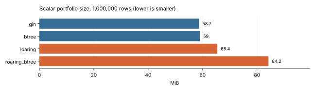

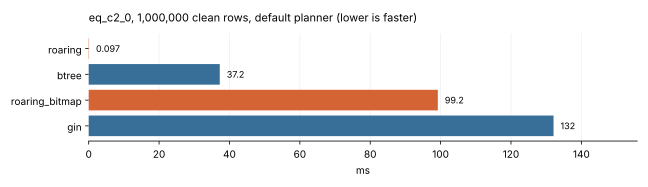

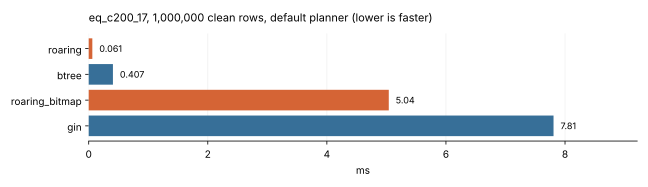

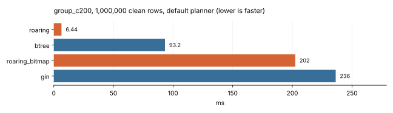

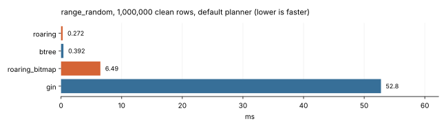

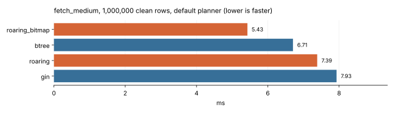

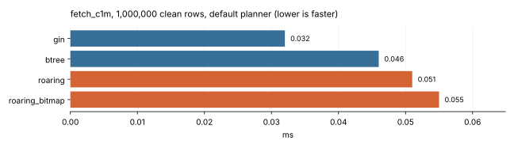

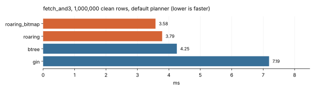

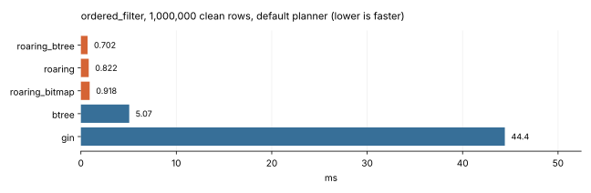

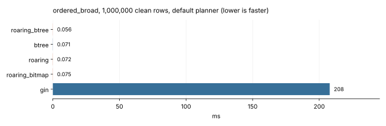

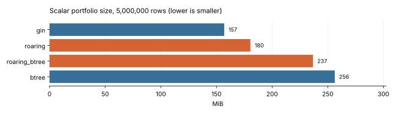

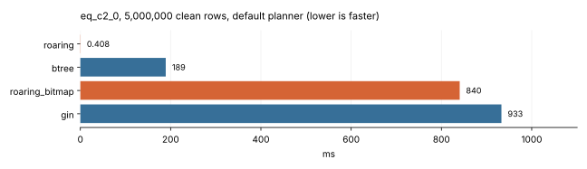

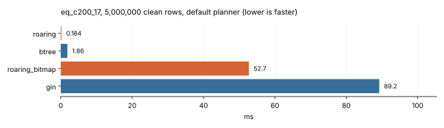

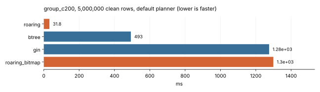

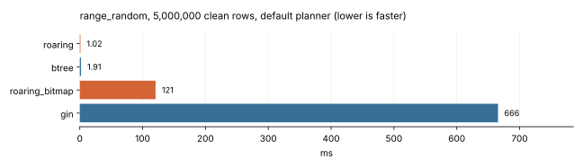

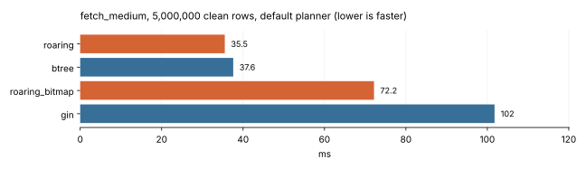

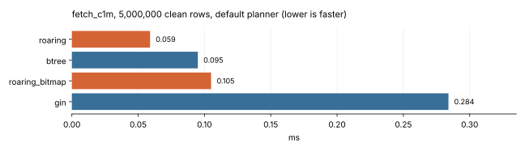

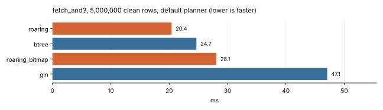

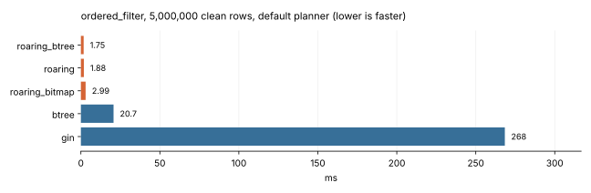

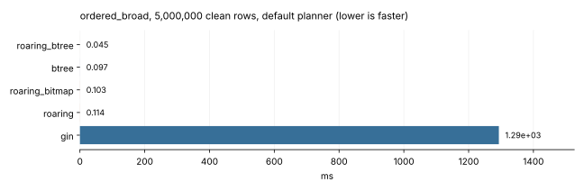

## Maintenance (single observations)

| Rows | Family | Operation | Elapsed attempt ms | WAL MiB | Indexes MiB after | Status |
| --- | --- | --- | --- | --- | --- | --- |
| 1000000 | gin | insert | 98.186 | 12.297 | 60.055 | ok |
| 1000000 | gin | indexed_update | 205.660 | 15.622 | 61.430 | ok |
| 1000000 | gin | delete | 258.906 | 73.227 | 61.430 | ok |
| 1000000 | gin | vacuum | 930.547 | 141.282 | 61.664 | ok |
| 1000000 | btree | insert | 278.543 | 32.628 | 59.383 | ok |
| 1000000 | btree | indexed_update | 493.480 | 36.890 | 59.750 | ok |
| 1000000 | btree | delete | 289.585 | 73.227 | 59.750 | ok |
| 1000000 | btree | vacuum | 707.536 | 133.799 | 59.750 | ok |
| 1000000 | roaring | insert | 374.350 | 51.000 | 65.430 | ok |
| 1000000 | roaring | indexed_update | 534.594 | 59.807 | 66.711 | ok |
| 1000000 | roaring | delete | 265.187 | 73.227 | 66.711 | ok |
| 1000000 | roaring | vacuum | 795.581 | 135.649 | 66.711 | ok |
| 5000000 | roaring | insert | 1885.903 | 176.887 | 181.930 | ok |
| 5000000 | roaring | indexed_update | 2535.085 | 208.796 | 186.219 | ok |
| 5000000 | roaring | delete | 1731.304 | 366.125 | 186.219 | ok |
| 5000000 | roaring | vacuum | 4377.122 | 559.344 | 186.219 | ok |
| 5000000 | btree | insert | 1415.318 | 119.585 | 260.078 | ok |
| 5000000 | btree | indexed_update | 2952.549 | 138.527 | 263.102 | ok |
| 5000000 | btree | delete | 2275.425 | 366.125 | 263.102 | ok |
| 5000000 | btree | vacuum | 4158.198 | 634.379 | 263.102 | ok |
| 5000000 | gin | insert | 496.147 | 61.368 | 163.727 | ok |
| 5000000 | gin | indexed_update | 1190.321 | 77.888 | 170.492 | ok |
| 5000000 | gin | delete | 1767.430 | 366.125 | 170.492 | ok |
| 5000000 | gin | vacuum | 4776.457 | 587.322 | 172.297 | ok |

## Concurrent reads

| Rows | Variant | Clients | Query | Transactions/s | Median ms | p95 ms | Duration s |
| --- | --- | --- | --- | --- | --- | --- | --- |

## Every query and configuration

| Suite | Rows | State | Planner | work_mem | Query | Variant | n | Execution median ms | 95% CI ms | p95 ms | CV | Speedup vs seq | Access | Planning median ms | Plan+execution median ms |
| --- | --- | --- | --- | --- | --- | --- | --- | --- | --- | --- | --- | --- | --- | --- | --- |
| documents | 200000 | clean | default | 64MB | array_and | gin | 3 | 1.248 | 1.208–1.949 | 1.879 | 28.4% | — | Bitmap Heap Scan, Bitmap Index Scan | 0.131 | 1.377 |
| documents | 200000 | clean | default | 64MB | array_and | roaring | 3 | 0.122 | 0.117–0.169 | 0.164 | 21.1% | — | LionCount | 0.189 | 0.311 |
| documents | 200000 | clean | default | 64MB | array_and | roaring_bitmap | 3 | 0.303 | 0.273–0.305 | 0.305 | 6.1% | — | Index Scan | 0.123 | 0.426 |
| documents | 200000 | clean | default | 64MB | array_common | gin | 3 | 12.027 | 8.743–13.425 | 13.285 | 21.1% | — | Bitmap Heap Scan, Bitmap Index Scan | 0.118 | 12.106 |
| documents | 200000 | clean | default | 64MB | array_common | roaring | 3 | 0.043 | 0.040–0.074 | 0.071 | 36.0% | — | LionCount | 0.113 | 0.153 |
| documents | 200000 | clean | default | 64MB | array_common | roaring_bitmap | 3 | 5.686 | 5.444–5.769 | 5.761 | 3.0% | — | Index Scan | 0.114 | 5.804 |
| documents | 200000 | clean | default | 64MB | array_or | gin | 3 | 19.995 | 14.155–22.255 | 22.029 | 22.2% | — | Bitmap Heap Scan, Bitmap Index Scan | 0.175 | 20.174 |
| documents | 200000 | clean | default | 64MB | array_or | roaring | 3 | 0.175 | 0.152–0.206 | 0.203 | 15.3% | — | LionCount | 0.123 | 0.329 |
| documents | 200000 | clean | default | 64MB | array_or | roaring_bitmap | 3 | 10.787 | 10.402–10.796 | 10.795 | 2.1% | — | Bitmap Heap Scan, Bitmap Index Scan | 0.091 | 10.868 |
| documents | 200000 | clean | default | 64MB | ts_and | gin | 3 | 1.330 | 1.262–1.403 | 1.396 | 5.3% | — | Bitmap Heap Scan, Bitmap Index Scan | 0.096 | 1.449 |
| documents | 200000 | clean | default | 64MB | ts_and | roaring | 3 | 0.159 | 0.093–0.174 | 0.172 | 30.3% | — | LionCount | 0.163 | 0.322 |
| documents | 200000 | clean | default | 64MB | ts_and | roaring_bitmap | 3 | 0.289 | 0.259–0.290 | 0.290 | 6.3% | — | Index Scan | 0.083 | 0.372 |
| documents | 200000 | clean | default | 64MB | ts_common | gin | 3 | 52.856 | 46.674–62.720 | 61.734 | 15.0% | — | Seq Scan (fallback) | 0.129 | 53.009 |
| documents | 200000 | clean | default | 64MB | ts_common | roaring | 3 | 0.092 | 0.071–0.100 | 0.099 | 17.1% | — | LionCount | 0.178 | 0.270 |
| documents | 200000 | clean | default | 64MB | ts_common | roaring_bitmap | 3 | 41.823 | 41.428–42.923 | 42.813 | 1.8% | — | Seq Scan (fallback) | 0.117 | 41.940 |
| documents | 200000 | clean | default | 64MB | ts_fetch | gin | 3 | 16.646 | 12.763–17.269 | 17.207 | 15.7% | — | Bitmap Heap Scan, Bitmap Index Scan | 0.167 | 16.814 |
| documents | 200000 | clean | default | 64MB | ts_fetch | roaring | 3 | 9.510 | 9.297–12.508 | 12.208 | 17.2% | — | Index Scan | 0.080 | 9.590 |
| documents | 200000 | clean | default | 64MB | ts_fetch | roaring_bitmap | 3 | 7.315 | 7.307–7.381 | 7.374 | 0.6% | — | Index Scan | 0.084 | 7.420 |
| documents | 200000 | clean | default | 64MB | ts_not | gin | 3 | 66.546 | 54.114–68.130 | 67.972 | 12.2% | — | Seq Scan (fallback) | 0.111 | 66.701 |
| documents | 200000 | clean | default | 64MB | ts_not | roaring | 3 | 11.259 | 11.217–12.678 | 12.536 | 7.1% | — | LionCount | 0.104 | 11.406 |
| documents | 200000 | clean | default | 64MB | ts_not | roaring_bitmap | 3 | 50.695 | 50.603–51.690 | 51.590 | 1.2% | — | Seq Scan (fallback) | 0.075 | 50.770 |
| documents | 200000 | clean | default | 64MB | ts_phrase | gin | 3 | 14.712 | 14.712–18.628 | 18.236 | 14.1% | — | Bitmap Heap Scan, Bitmap Index Scan | 0.115 | 14.827 |
| documents | 200000 | clean | default | 64MB | ts_phrase | roaring | 3 | 3.904 | 3.866–3.985 | 3.977 | 1.6% | — | LionCount | 0.095 | 3.999 |
| documents | 200000 | clean | default | 64MB | ts_phrase | roaring_bitmap | 3 | 9.378 | 9.007–9.403 | 9.401 | 2.4% | — | Index Scan | 0.108 | 9.486 |
| documents | 200000 | clean | default | 64MB | ts_prefix | gin | 3 | 3.569 | 3.484–4.164 | 4.104 | 9.9% | — | Bitmap Heap Scan, Bitmap Index Scan | 0.092 | 3.661 |
| documents | 200000 | clean | default | 64MB | ts_prefix | roaring | 3 | 40.196 | 39.095–41.735 | 41.581 | 3.3% | — | Seq Scan (fallback) | 0.131 | 40.347 |
| documents | 200000 | clean | default | 64MB | ts_prefix | roaring_bitmap | 3 | 35.988 | 35.063–36.060 | 36.053 | 1.6% | — | Seq Scan (fallback) | 0.110 | 36.049 |
| documents | 200000 | clean | default | 64MB | ts_rare | gin | 3 | 0.073 | 0.071–0.081 | 0.080 | 7.1% | — | Bitmap Heap Scan, Bitmap Index Scan | 0.112 | 0.183 |
| documents | 200000 | clean | default | 64MB | ts_rare | roaring | 3 | 0.031 | 0.030–0.044 | 0.043 | 22.3% | — | LionCount | 0.163 | 0.201 |
| documents | 200000 | clean | default | 64MB | ts_rare | roaring_bitmap | 3 | 0.071 | 0.054–0.074 | 0.074 | 16.3% | — | Index Scan | 0.104 | 0.175 |
| documents | 200000 | clean | default | 64MB | ts_tree | gin | 3 | 4.836 | 4.670–6.514 | 6.346 | 19.1% | — | Bitmap Heap Scan, Bitmap Index Scan | 0.123 | 5.006 |
| documents | 200000 | clean | default | 64MB | ts_tree | roaring | 3 | 0.260 | 0.255–0.325 | 0.319 | 13.9% | — | LionCount | 0.108 | 0.368 |
| documents | 200000 | clean | default | 64MB | ts_tree | roaring_bitmap | 3 | 0.915 | 0.880–1.040 | 1.028 | 8.9% | — | Index Scan | 0.118 | 0.998 |
| documents | 200000 | clean | default | 64MB | ts_weight | gin | 3 | 18.126 | 17.906–24.757 | 24.094 | 19.2% | — | Bitmap Heap Scan, Bitmap Index Scan | 0.151 | 18.258 |
| documents | 200000 | clean | default | 64MB | ts_weight | roaring | 3 | 0.524 | 0.506–0.560 | 0.556 | 5.2% | — | LionCount | 0.104 | 0.626 |
| documents | 200000 | clean | default | 64MB | ts_weight | roaring_bitmap | 3 | 6.086 | 5.861–6.189 | 6.179 | 2.8% | — | Index Scan | 0.108 | 6.195 |
| scalar | 1000000 | after_maintenance | default | 64MB | and2 | btree | 3 | 6.591 | 6.213–6.676 | 6.668 | 3.8% | — | Bitmap Heap Scan, Bitmap Index Scan | 0.115 | 6.706 |
| scalar | 1000000 | after_maintenance | default | 64MB | and2 | gin | 3 | 59.901 | 42.081–75.464 | 73.908 | 28.2% | — | Bitmap Heap Scan, Bitmap Index Scan | 0.123 | 60.012 |
| scalar | 1000000 | after_maintenance | default | 64MB | and2 | roaring | 3 | 0.161 | 0.160–0.164 | 0.164 | 1.3% | — | LionCount | 0.111 | 0.272 |
| scalar | 1000000 | after_maintenance | default | 64MB | and2 | roaring_bitmap | 3 | 10.304 | 10.245–10.457 | 10.442 | 1.1% | — | Bitmap Heap Scan, Bitmap Index Scan | 0.132 | 10.436 |
| scalar | 1000000 | after_maintenance | default | 64MB | eq_c200_17 | btree | 3 | 0.430 | 0.428–0.458 | 0.455 | 3.8% | — | Index Only Scan | 0.092 | 0.521 |
| scalar | 1000000 | after_maintenance | default | 64MB | eq_c200_17 | gin | 3 | 10.103 | 8.310–10.429 | 10.396 | 11.9% | — | Bitmap Heap Scan, Bitmap Index Scan | 0.143 | 10.246 |
| scalar | 1000000 | after_maintenance | default | 64MB | eq_c200_17 | roaring | 3 | 0.044 | 0.043–0.055 | 0.054 | 14.1% | — | LionCount | 0.065 | 0.109 |
| scalar | 1000000 | after_maintenance | default | 64MB | eq_c200_17 | roaring_bitmap | 3 | 5.416 | 5.330–6.641 | 6.518 | 12.7% | — | Index Scan | 0.118 | 5.522 |
| scalar | 1000000 | after_maintenance | default | 64MB | group_c200 | btree | 3 | 93.163 | 92.630–97.740 | 97.282 | 3.0% | — | Index Only Scan | 0.083 | 93.218 |
| scalar | 1000000 | after_maintenance | default | 64MB | group_c200 | gin | 3 | 206.875 | 198.842–226.577 | 224.607 | 6.8% | — | Seq Scan (fallback) | 0.092 | 206.967 |
| scalar | 1000000 | after_maintenance | default | 64MB | group_c200 | roaring | 3 | 6.354 | 6.257–6.582 | 6.559 | 2.6% | — | LionCount | 0.052 | 6.406 |
| scalar | 1000000 | after_maintenance | default | 64MB | group_c200 | roaring_bitmap | 3 | 199.444 | 189.041–210.313 | 209.226 | 5.3% | — | Seq Scan (fallback) | 0.098 | 199.526 |
| scalar | 1000000 | after_maintenance | default | 64MB | is_null | btree | 3 | 7.275 | 7.183–7.324 | 7.319 | 1.0% | — | Index Only Scan | 0.084 | 7.355 |
| scalar | 1000000 | after_maintenance | default | 64MB | is_null | gin | 3 | 98.631 | 97.720–126.275 | 123.511 | 15.1% | — | Seq Scan (fallback) | 0.112 | 98.699 |
| scalar | 1000000 | after_maintenance | default | 64MB | is_null | roaring | 3 | 0.095 | 0.088–0.096 | 0.096 | 4.7% | — | LionCount | 0.054 | 0.145 |
| scalar | 1000000 | after_maintenance | default | 64MB | is_null | roaring_bitmap | 3 | 47.073 | 42.641–47.473 | 47.433 | 5.9% | — | Bitmap Heap Scan, Bitmap Index Scan | 0.095 | 47.168 |
| scalar | 1000000 | clean | default | 64MB | and2 | btree | 3 | 6.262 | 6.192–6.517 | 6.492 | 2.7% | — | Bitmap Heap Scan, Bitmap Index Scan | 0.117 | 6.369 |
| scalar | 1000000 | clean | default | 64MB | and2 | gin | 3 | 41.937 | 40.374–51.564 | 50.601 | 13.6% | — | Bitmap Heap Scan, Bitmap Index Scan | 0.118 | 42.063 |
| scalar | 1000000 | clean | default | 64MB | and2 | roaring | 3 | 0.170 | 0.162–0.264 | 0.255 | 28.6% | — | LionCount | 0.116 | 0.286 |
| scalar | 1000000 | clean | default | 64MB | and2 | roaring_bitmap | 3 | 10.345 | 10.223–10.402 | 10.396 | 0.9% | — | Bitmap Heap Scan, Bitmap Index Scan | 0.095 | 10.464 |
| scalar | 1000000 | clean | default | 64MB | and3_selective | btree | 3 | 0.566 | 0.422–0.578 | 0.577 | 16.6% | — | Bitmap Heap Scan, Bitmap Index Scan | 0.069 | 0.634 |
| scalar | 1000000 | clean | default | 64MB | and3_selective | gin | 3 | 0.860 | 0.802–1.292 | 1.249 | 27.2% | — | Bitmap Heap Scan, Bitmap Index Scan | 0.137 | 0.997 |
| scalar | 1000000 | clean | default | 64MB | and3_selective | roaring | 3 | 0.054 | 0.046–0.062 | 0.061 | 14.8% | — | LionCount | 0.124 | 0.186 |
| scalar | 1000000 | clean | default | 64MB | and3_selective | roaring_bitmap | 3 | 0.553 | 0.542–0.585 | 0.582 | 4.0% | — | Bitmap Heap Scan, Bitmap Index Scan | 0.151 | 0.707 |
| scalar | 1000000 | clean | default | 64MB | eq_c1m_12345 | btree | 3 | 0.027 | 0.022–0.037 | 0.036 | 26.6% | — | Index Only Scan | 0.078 | 0.105 |
| scalar | 1000000 | clean | default | 64MB | eq_c1m_12345 | gin | 3 | 0.047 | 0.027–0.048 | 0.048 | 29.1% | — | Bitmap Heap Scan, Bitmap Index Scan | 0.091 | 0.138 |
| scalar | 1000000 | clean | default | 64MB | eq_c1m_12345 | roaring | 3 | 0.020 | 0.018–0.049 | 0.046 | 59.8% | — | LionCount | 0.063 | 0.083 |
| scalar | 1000000 | clean | default | 64MB | eq_c1m_12345 | roaring_bitmap | 3 | 0.054 | 0.050–0.059 | 0.058 | 8.3% | — | Index Scan | 0.116 | 0.172 |
| scalar | 1000000 | clean | default | 64MB | eq_c200_17 | btree | 3 | 0.407 | 0.393–0.431 | 0.429 | 4.7% | — | Index Only Scan | 0.082 | 0.513 |
| scalar | 1000000 | clean | default | 64MB | eq_c200_17 | gin | 3 | 7.807 | 6.909–8.950 | 8.836 | 13.0% | — | Bitmap Heap Scan, Bitmap Index Scan | 0.140 | 7.947 |
| scalar | 1000000 | clean | default | 64MB | eq_c200_17 | roaring | 3 | 0.061 | 0.052–0.085 | 0.083 | 25.8% | — | LionCount | 0.119 | 0.180 |
| scalar | 1000000 | clean | default | 64MB | eq_c200_17 | roaring_bitmap | 3 | 5.040 | 4.973–5.090 | 5.085 | 1.2% | — | Index Scan | 0.074 | 5.114 |
| scalar | 1000000 | clean | default | 64MB | eq_c20k_123 | btree | 3 | 0.039 | 0.028–0.048 | 0.047 | 26.1% | — | Index Only Scan | 0.100 | 0.139 |
| scalar | 1000000 | clean | default | 64MB | eq_c20k_123 | gin | 3 | 0.103 | 0.081–0.106 | 0.106 | 14.1% | — | Bitmap Heap Scan, Bitmap Index Scan | 0.088 | 0.191 |
| scalar | 1000000 | clean | default | 64MB | eq_c20k_123 | roaring | 3 | 0.021 | 0.020–0.040 | 0.038 | 41.7% | — | LionCount | 0.065 | 0.085 |
| scalar | 1000000 | clean | default | 64MB | eq_c20k_123 | roaring_bitmap | 3 | 0.111 | 0.087–0.114 | 0.114 | 14.2% | — | Index Scan | 0.125 | 0.236 |
| scalar | 1000000 | clean | default | 64MB | eq_c2_0 | btree | 3 | 37.246 | 36.431–37.345 | 37.335 | 1.4% | — | Index Only Scan | 0.052 | 37.293 |
| scalar | 1000000 | clean | default | 64MB | eq_c2_0 | gin | 3 | 132.090 | 128.889–141.465 | 140.528 | 4.9% | — | Bitmap Heap Scan, Bitmap Index Scan | 0.106 | 132.196 |
| scalar | 1000000 | clean | default | 64MB | eq_c2_0 | roaring | 3 | 0.097 | 0.092–0.216 | 0.204 | 52.0% | — | LionCount | 0.097 | 0.194 |
| scalar | 1000000 | clean | default | 64MB | eq_c2_0 | roaring_bitmap | 3 | 99.213 | 96.897–120.749 | 118.595 | 12.5% | — | Bitmap Heap Scan, Bitmap Index Scan | 0.056 | 99.269 |
| scalar | 1000000 | clean | default | 64MB | eq_skew_0 | btree | 3 | 67.927 | 65.613–87.964 | 85.960 | 16.6% | — | Index Only Scan | 0.053 | 68.030 |
| scalar | 1000000 | clean | default | 64MB | eq_skew_0 | gin | 3 | 122.387 | 118.899–137.086 | 135.616 | 7.7% | — | Seq Scan (fallback) | 0.110 | 122.518 |
| scalar | 1000000 | clean | default | 64MB | eq_skew_0 | roaring | 3 | 0.111 | 0.081–0.140 | 0.137 | 26.7% | — | LionCount | 0.066 | 0.167 |
| scalar | 1000000 | clean | default | 64MB | eq_skew_0 | roaring_bitmap | 3 | 123.248 | 121.323–124.020 | 123.943 | 1.1% | — | Seq Scan (fallback) | 0.072 | 123.298 |
| scalar | 1000000 | clean | default | 64MB | eq_skew_17 | btree | 3 | 0.040 | 0.033–0.051 | 0.050 | 22.0% | — | Index Only Scan | 0.080 | 0.120 |
| scalar | 1000000 | clean | default | 64MB | eq_skew_17 | gin | 3 | 0.191 | 0.189–0.265 | 0.258 | 20.1% | — | Bitmap Heap Scan, Bitmap Index Scan | 0.055 | 0.244 |
| scalar | 1000000 | clean | default | 64MB | eq_skew_17 | roaring | 3 | 0.021 | 0.021–0.022 | 0.022 | 2.7% | — | LionCount | 0.064 | 0.085 |
| scalar | 1000000 | clean | default | 64MB | eq_skew_17 | roaring_bitmap | 3 | 0.206 | 0.204–0.213 | 0.212 | 2.3% | — | Index Scan | 0.125 | 0.331 |
| scalar | 1000000 | clean | default | 64MB | fetch_and2 | btree | 3 | 4.170 | 4.135–4.410 | 4.386 | 3.5% | — | Bitmap Heap Scan, Bitmap Index Scan | 0.168 | 4.344 |
| scalar | 1000000 | clean | default | 64MB | fetch_and2 | gin | 3 | 6.823 | 6.796–8.224 | 8.084 | 11.2% | — | Bitmap Heap Scan, Bitmap Index Scan | 0.128 | 6.952 |
| scalar | 1000000 | clean | default | 64MB | fetch_and2 | roaring | 3 | 3.844 | 3.841–4.798 | 4.703 | 13.3% | — | Bitmap Heap Scan, Bitmap Index Scan | 0.088 | 3.942 |
| scalar | 1000000 | clean | default | 64MB | fetch_and2 | roaring_bitmap | 3 | 3.702 | 3.600–4.084 | 4.046 | 6.7% | — | Bitmap Heap Scan, Bitmap Index Scan | 0.139 | 3.841 |
| scalar | 1000000 | clean | default | 64MB | fetch_and3 | btree | 3 | 4.254 | 4.198–4.362 | 4.351 | 2.0% | — | Bitmap Heap Scan, Bitmap Index Scan | 0.126 | 4.328 |
| scalar | 1000000 | clean | default | 64MB | fetch_and3 | gin | 3 | 7.188 | 6.803–7.392 | 7.372 | 4.2% | — | Bitmap Heap Scan, Bitmap Index Scan | 0.135 | 7.322 |
| scalar | 1000000 | clean | default | 64MB | fetch_and3 | roaring | 3 | 3.787 | 3.770–3.828 | 3.824 | 0.8% | — | Bitmap Heap Scan, Bitmap Index Scan | 0.135 | 3.910 |
| scalar | 1000000 | clean | default | 64MB | fetch_and3 | roaring_bitmap | 3 | 3.575 | 3.208–3.769 | 3.750 | 8.1% | — | Bitmap Heap Scan, Bitmap Index Scan | 0.133 | 3.708 |
| scalar | 1000000 | clean | default | 64MB | fetch_broad | btree | 3 | 35.471 | 35.378–35.556 | 35.547 | 0.3% | — | Bitmap Heap Scan, Bitmap Index Scan | 0.091 | 35.519 |
| scalar | 1000000 | clean | default | 64MB | fetch_broad | gin | 3 | 38.171 | 37.951–41.144 | 40.847 | 4.6% | — | Bitmap Heap Scan, Bitmap Index Scan | 0.113 | 38.285 |
| scalar | 1000000 | clean | default | 64MB | fetch_broad | roaring | 3 | 36.033 | 35.994–58.299 | 56.072 | 29.6% | — | Bitmap Heap Scan, Bitmap Index Scan | 0.063 | 36.104 |
| scalar | 1000000 | clean | default | 64MB | fetch_broad | roaring_bitmap | 3 | 37.562 | 35.479–41.734 | 41.317 | 8.3% | — | Bitmap Heap Scan, Bitmap Index Scan | 0.080 | 37.642 |
| scalar | 1000000 | clean | default | 64MB | fetch_c1m | btree | 3 | 0.046 | 0.036–0.058 | 0.057 | 23.6% | — | Index Scan | 0.128 | 0.174 |
| scalar | 1000000 | clean | default | 64MB | fetch_c1m | gin | 3 | 0.032 | 0.028–0.053 | 0.051 | 35.7% | — | Bitmap Heap Scan, Bitmap Index Scan | 0.050 | 0.082 |
| scalar | 1000000 | clean | default | 64MB | fetch_c1m | roaring | 3 | 0.051 | 0.044–0.083 | 0.080 | 35.0% | — | Index Scan | 0.084 | 0.144 |
| scalar | 1000000 | clean | default | 64MB | fetch_c1m | roaring_bitmap | 3 | 0.055 | 0.038–0.060 | 0.059 | 22.6% | — | Index Scan | 0.126 | 0.186 |
| scalar | 1000000 | clean | default | 64MB | fetch_in_and | btree | 3 | 10.611 | 10.561–11.747 | 11.633 | 6.1% | — | Bitmap Heap Scan, Bitmap Index Scan | 0.110 | 10.741 |
| scalar | 1000000 | clean | default | 64MB | fetch_in_and | gin | 3 | 18.857 | 18.566–19.294 | 19.250 | 1.9% | — | Bitmap Heap Scan, Bitmap Index Scan | 0.126 | 18.936 |
| scalar | 1000000 | clean | default | 64MB | fetch_in_and | roaring | 3 | 10.364 | 9.190–11.247 | 11.159 | 10.1% | — | Bitmap Heap Scan, Bitmap Index Scan | 0.077 | 10.459 |
| scalar | 1000000 | clean | default | 64MB | fetch_in_and | roaring_bitmap | 3 | 10.199 | 10.001–10.899 | 10.829 | 4.6% | — | Bitmap Heap Scan, Bitmap Index Scan | 0.153 | 10.352 |
| scalar | 1000000 | clean | default | 64MB | fetch_medium | btree | 3 | 6.706 | 6.701–6.827 | 6.815 | 1.1% | — | Bitmap Heap Scan, Bitmap Index Scan | 0.106 | 6.819 |
| scalar | 1000000 | clean | default | 64MB | fetch_medium | gin | 3 | 7.929 | 7.347–14.299 | 13.662 | 39.1% | — | Bitmap Heap Scan, Bitmap Index Scan | 0.116 | 8.049 |
| scalar | 1000000 | clean | default | 64MB | fetch_medium | roaring | 3 | 7.386 | 5.843–7.436 | 7.431 | 13.1% | — | Index Scan | 0.062 | 7.445 |
| scalar | 1000000 | clean | default | 64MB | fetch_medium | roaring_bitmap | 3 | 5.428 | 5.322–5.945 | 5.893 | 6.0% | — | Index Scan | 0.056 | 5.484 |
| scalar | 1000000 | clean | default | 64MB | fetch_rare | btree | 3 | 0.110 | 0.107–0.136 | 0.133 | 13.6% | — | Bitmap Heap Scan, Bitmap Index Scan | 0.098 | 0.208 |
| scalar | 1000000 | clean | default | 64MB | fetch_rare | gin | 3 | 0.117 | 0.115–0.119 | 0.119 | 1.7% | — | Bitmap Heap Scan, Bitmap Index Scan | 0.099 | 0.218 |
| scalar | 1000000 | clean | default | 64MB | fetch_rare | roaring | 3 | 0.102 | 0.096–0.126 | 0.124 | 14.7% | — | Index Scan | 0.077 | 0.173 |
| scalar | 1000000 | clean | default | 64MB | fetch_rare | roaring_bitmap | 3 | 0.121 | 0.119–0.162 | 0.158 | 18.1% | — | Index Scan | 0.111 | 0.237 |
| scalar | 1000000 | clean | default | 64MB | group_c2 | btree | 3 | 92.526 | 91.382–93.027 | 92.977 | 0.9% | — | Index Only Scan | 0.059 | 92.575 |
| scalar | 1000000 | clean | default | 64MB | group_c2 | gin | 3 | 173.735 | 167.873–237.422 | 231.053 | 20.0% | — | Seq Scan (fallback) | 0.092 | 173.827 |
| scalar | 1000000 | clean | default | 64MB | group_c2 | roaring | 3 | 0.152 | 0.148–1.015 | 0.929 | 113.9% | — | LionCount | 0.058 | 0.227 |
| scalar | 1000000 | clean | default | 64MB | group_c2 | roaring_bitmap | 3 | 195.746 | 179.066–202.490 | 201.816 | 6.3% | — | Seq Scan (fallback) | 0.052 | 195.798 |
| scalar | 1000000 | clean | default | 64MB | group_c200 | btree | 3 | 93.202 | 91.929–108.270 | 106.763 | 9.3% | — | Index Only Scan | 0.058 | 93.260 |
| scalar | 1000000 | clean | default | 64MB | group_c200 | gin | 3 | 236.357 | 188.159–260.353 | 257.953 | 16.1% | — | Seq Scan (fallback) | 0.081 | 236.398 |
| scalar | 1000000 | clean | default | 64MB | group_c200 | roaring | 3 | 6.439 | 6.311–6.904 | 6.857 | 4.8% | — | LionCount | 0.077 | 6.523 |
| scalar | 1000000 | clean | default | 64MB | group_c200 | roaring_bitmap | 3 | 202.464 | 196.986–247.911 | 243.366 | 13.0% | — | Seq Scan (fallback) | 0.074 | 202.564 |
| scalar | 1000000 | clean | default | 64MB | group_filtered | btree | 3 | 7.003 | 6.736–7.865 | 7.779 | 8.2% | — | Bitmap Heap Scan, Bitmap Index Scan | 0.120 | 7.131 |
| scalar | 1000000 | clean | default | 64MB | group_filtered | gin | 3 | 7.652 | 7.236–10.544 | 10.255 | 21.3% | — | Bitmap Heap Scan, Bitmap Index Scan | 0.112 | 7.766 |
| scalar | 1000000 | clean | default | 64MB | group_filtered | roaring | 3 | 3.818 | 3.724–3.902 | 3.894 | 2.3% | — | LionCount | 0.104 | 3.973 |
| scalar | 1000000 | clean | default | 64MB | group_filtered | roaring_bitmap | 3 | 5.657 | 5.601–6.053 | 6.013 | 4.3% | — | Index Scan | 0.097 | 5.745 |
| scalar | 1000000 | clean | default | 64MB | in_and | btree | 3 | 10.711 | 10.086–11.021 | 10.990 | 4.5% | — | Bitmap Heap Scan, Bitmap Index Scan | 0.122 | 10.801 |
| scalar | 1000000 | clean | default | 64MB | in_and | gin | 3 | 19.791 | 18.222–20.102 | 20.071 | 5.2% | — | Bitmap Heap Scan, Bitmap Index Scan | 0.076 | 19.865 |
| scalar | 1000000 | clean | default | 64MB | in_and | roaring | 3 | 0.941 | 0.866–1.261 | 1.229 | 20.5% | — | LionCount | 0.143 | 1.084 |
| scalar | 1000000 | clean | default | 64MB | in_and | roaring_bitmap | 3 | 9.678 | 9.294–9.880 | 9.860 | 3.1% | — | Bitmap Heap Scan, Bitmap Index Scan | 0.113 | 9.791 |
| scalar | 1000000 | clean | default | 64MB | in_c20k_10 | btree | 3 | 0.075 | 0.067–0.075 | 0.075 | 6.4% | — | Index Only Scan | 0.089 | 0.164 |
| scalar | 1000000 | clean | default | 64MB | in_c20k_10 | gin | 3 | 0.905 | 0.904–0.958 | 0.953 | 3.3% | — | Bitmap Heap Scan, Bitmap Index Scan | 0.135 | 1.040 |
| scalar | 1000000 | clean | default | 64MB | in_c20k_10 | roaring | 3 | 0.043 | 0.041–0.059 | 0.057 | 20.7% | — | LionCount | 0.082 | 0.141 |
| scalar | 1000000 | clean | default | 64MB | in_c20k_10 | roaring_bitmap | 3 | 0.741 | 0.708–0.749 | 0.748 | 3.0% | — | Index Scan | 0.070 | 0.811 |
| scalar | 1000000 | clean | default | 64MB | in_c20k_1000 | btree | 3 | 3.763 | 3.752–3.919 | 3.903 | 2.5% | — | Index Only Scan | 0.707 | 4.463 |
| scalar | 1000000 | clean | default | 64MB | in_c20k_1000 | gin | 3 | 36.372 | 34.519–36.823 | 36.778 | 3.4% | — | Bitmap Heap Scan, Bitmap Index Scan | 1.019 | 37.441 |
| scalar | 1000000 | clean | default | 64MB | in_c20k_1000 | roaring | 3 | 2.577 | 2.408–4.617 | 4.413 | 38.4% | — | LionCount | 2.460 | 5.223 |
| scalar | 1000000 | clean | default | 64MB | in_c20k_1000 | roaring_bitmap | 3 | 34.322 | 32.771–34.706 | 34.668 | 3.0% | — | Index Scan | 0.858 | 35.167 |
| scalar | 1000000 | clean | default | 64MB | is_null | btree | 3 | 7.239 | 7.216–7.306 | 7.299 | 0.6% | — | Index Only Scan | 0.093 | 7.339 |
| scalar | 1000000 | clean | default | 64MB | is_null | gin | 3 | 93.253 | 91.324–119.919 | 117.252 | 15.7% | — | Seq Scan (fallback) | 0.071 | 93.284 |
| scalar | 1000000 | clean | default | 64MB | is_null | roaring | 3 | 0.095 | 0.087–0.135 | 0.131 | 24.3% | — | LionCount | 0.052 | 0.183 |
| scalar | 1000000 | clean | default | 64MB | is_null | roaring_bitmap | 3 | 41.751 | 41.406–43.705 | 43.510 | 2.9% | — | Bitmap Heap Scan, Bitmap Index Scan | 0.103 | 41.848 |
| scalar | 1000000 | clean | default | 64MB | or_columns | btree | 3 | 34.890 | 33.194–35.986 | 35.876 | 4.1% | — | Bitmap Heap Scan, Bitmap Index Scan | 0.117 | 35.011 |
| scalar | 1000000 | clean | default | 64MB | or_columns | gin | 3 | 33.699 | 33.356–34.238 | 34.184 | 1.3% | — | Bitmap Heap Scan, Bitmap Index Scan | 0.100 | 33.799 |
| scalar | 1000000 | clean | default | 64MB | or_columns | roaring | 3 | 0.286 | 0.260–0.307 | 0.305 | 8.3% | — | LionCount | 0.116 | 0.423 |
| scalar | 1000000 | clean | default | 64MB | or_columns | roaring_bitmap | 3 | 31.144 | 31.093–31.728 | 31.670 | 1.1% | — | Bitmap Heap Scan, Bitmap Index Scan | 0.122 | 31.235 |
| scalar | 1000000 | clean | default | 64MB | ordered_broad | btree | 3 | 0.071 | 0.069–0.086 | 0.084 | 12.3% | — | Index Scan | 0.085 | 0.156 |
| scalar | 1000000 | clean | default | 64MB | ordered_broad | gin | 3 | 207.890 | 202.799–245.109 | 241.387 | 10.6% | — | Bitmap Heap Scan, Bitmap Index Scan | 0.137 | 208.027 |
| scalar | 1000000 | clean | default | 64MB | ordered_broad | roaring | 3 | 0.072 | 0.070–0.082 | 0.081 | 8.6% | — | LionOrdered | 0.103 | 0.185 |
| scalar | 1000000 | clean | default | 64MB | ordered_broad | roaring_bitmap | 3 | 0.075 | 0.073–0.093 | 0.091 | 13.7% | — | LionOrdered | 0.138 | 0.213 |
| scalar | 1000000 | clean | default | 64MB | ordered_broad | roaring_btree | 3 | 0.056 | 0.048–0.072 | 0.070 | 20.8% | — | Index Scan | 0.089 | 0.145 |
| scalar | 1000000 | clean | default | 64MB | ordered_filter | btree | 3 | 5.065 | 4.850–5.209 | 5.195 | 3.6% | — | Index Scan | 0.089 | 5.138 |
| scalar | 1000000 | clean | default | 64MB | ordered_filter | gin | 3 | 44.425 | 41.064–74.088 | 71.122 | 34.2% | — | Bitmap Heap Scan, Bitmap Index Scan | 0.136 | 44.558 |
| scalar | 1000000 | clean | default | 64MB | ordered_filter | roaring | 3 | 0.822 | 0.804–0.945 | 0.933 | 9.0% | — | LionOrdered | 0.106 | 0.952 |
| scalar | 1000000 | clean | default | 64MB | ordered_filter | roaring_bitmap | 3 | 0.918 | 0.864–0.989 | 0.982 | 6.8% | — | LionOrdered | 0.117 | 1.051 |
| scalar | 1000000 | clean | default | 64MB | ordered_filter | roaring_btree | 3 | 0.702 | 0.677–0.747 | 0.742 | 5.0% | — | LionOrdered | 0.106 | 0.809 |
| scalar | 1000000 | clean | default | 64MB | ordered_filter_desc | btree | 3 | 5.363 | 5.004–6.750 | 6.611 | 16.2% | — | Index Scan | 0.135 | 5.441 |
| scalar | 1000000 | clean | default | 64MB | ordered_filter_desc | gin | 3 | 41.097 | 39.942–42.093 | 41.993 | 2.6% | — | Bitmap Heap Scan, Bitmap Index Scan | 0.086 | 41.173 |
| scalar | 1000000 | clean | default | 64MB | ordered_filter_desc | roaring | 3 | 0.873 | 0.860–0.883 | 0.882 | 1.3% | — | LionOrdered | 0.126 | 0.994 |
| scalar | 1000000 | clean | default | 64MB | ordered_filter_desc | roaring_bitmap | 3 | 0.915 | 0.902–0.930 | 0.928 | 1.5% | — | LionOrdered | 0.167 | 1.069 |
| scalar | 1000000 | clean | default | 64MB | ordered_filter_desc | roaring_btree | 3 | 0.725 | 0.688–0.796 | 0.789 | 7.5% | — | LionOrdered | 0.121 | 0.871 |
| scalar | 1000000 | clean | default | 64MB | ordered_limit | btree | 3 | 0.033 | 0.031–0.036 | 0.036 | 7.5% | — | Index Only Scan | 0.151 | 0.184 |
| scalar | 1000000 | clean | default | 64MB | ordered_limit | gin | 3 | 129.141 | 124.175–140.779 | 139.615 | 6.5% | — | Seq Scan (fallback) | 0.126 | 129.267 |
| scalar | 1000000 | clean | default | 64MB | ordered_limit | roaring | 3 | 0.207 | 0.169–0.209 | 0.209 | 11.6% | — | LionOrdered | 0.104 | 0.313 |
| scalar | 1000000 | clean | default | 64MB | ordered_limit | roaring_bitmap | 3 | 0.174 | 0.152–0.205 | 0.202 | 15.0% | — | LionOrdered | 0.186 | 0.369 |
| scalar | 1000000 | clean | default | 64MB | range_random | btree | 3 | 0.392 | 0.384–0.576 | 0.558 | 24.1% | — | Index Only Scan | 0.131 | 0.550 |
| scalar | 1000000 | clean | default | 64MB | range_random | gin | 3 | 52.771 | 52.662–59.075 | 58.445 | 6.7% | — | Bitmap Heap Scan, Bitmap Index Scan | 0.123 | 52.894 |
| scalar | 1000000 | clean | default | 64MB | range_random | roaring | 3 | 0.272 | 0.219–0.274 | 0.274 | 12.2% | — | LionCount | 0.139 | 0.411 |
| scalar | 1000000 | clean | default | 64MB | range_random | roaring_bitmap | 3 | 6.487 | 6.357–6.609 | 6.597 | 1.9% | — | Bitmap Heap Scan, Bitmap Index Scan | 0.095 | 6.606 |
| scalar | 1000000 | dirty_scattered | default | 64MB | and2 | btree | 3 | 6.795 | 6.314–6.938 | 6.924 | 4.9% | — | Bitmap Heap Scan, Bitmap Index Scan | 0.107 | 6.930 |
| scalar | 1000000 | dirty_scattered | default | 64MB | and2 | gin | 3 | 39.882 | 39.556–41.791 | 41.600 | 3.0% | — | Bitmap Heap Scan, Bitmap Index Scan | 0.122 | 40.008 |
| scalar | 1000000 | dirty_scattered | default | 64MB | and2 | roaring | 3 | 1.629 | 1.595–1.712 | 1.704 | 3.7% | — | LionCount | 0.151 | 1.796 |
| scalar | 1000000 | dirty_scattered | default | 64MB | and2 | roaring_bitmap | 3 | 10.301 | 10.211–10.565 | 10.539 | 1.8% | — | Bitmap Heap Scan, Bitmap Index Scan | 0.125 | 10.426 |
| scalar | 1000000 | dirty_scattered | default | 64MB | eq_c200_17 | btree | 3 | 2.981 | 2.964–3.286 | 3.256 | 5.9% | — | Index Only Scan | 0.093 | 3.070 |
| scalar | 1000000 | dirty_scattered | default | 64MB | eq_c200_17 | gin | 3 | 6.640 | 6.462–6.825 | 6.806 | 2.7% | — | Bitmap Heap Scan, Bitmap Index Scan | 0.116 | 6.748 |
| scalar | 1000000 | dirty_scattered | default | 64MB | eq_c200_17 | roaring | 3 | 2.847 | 2.607–3.321 | 3.274 | 12.4% | — | LionCount | 0.179 | 3.026 |
| scalar | 1000000 | dirty_scattered | default | 64MB | eq_c200_17 | roaring_bitmap | 3 | 4.992 | 4.280–5.157 | 5.141 | 9.7% | — | Index Scan | 0.118 | 5.123 |
| scalar | 1000000 | dirty_scattered | default | 64MB | eq_c2_0 | btree | 3 | 121.216 | 110.323–124.604 | 124.265 | 6.3% | — | Bitmap Heap Scan, Bitmap Index Scan | 0.107 | 121.323 |
| scalar | 1000000 | dirty_scattered | default | 64MB | eq_c2_0 | gin | 3 | 125.661 | 124.097–126.763 | 126.653 | 1.1% | — | Bitmap Heap Scan, Bitmap Index Scan | 0.111 | 125.772 |
| scalar | 1000000 | dirty_scattered | default | 64MB | eq_c2_0 | roaring | 3 | 31.832 | 31.349–35.921 | 35.512 | 7.6% | — | LionCount | 0.105 | 31.957 |
| scalar | 1000000 | dirty_scattered | default | 64MB | eq_c2_0 | roaring_bitmap | 3 | 99.627 | 96.395–103.419 | 103.040 | 3.5% | — | Bitmap Heap Scan, Bitmap Index Scan | 0.106 | 99.728 |
| scalar | 1000000 | dirty_scattered | default | 64MB | group_c200 | btree | 3 | 239.891 | 224.452–245.505 | 244.944 | 4.6% | — | Seq Scan (fallback) | 0.079 | 239.970 |
| scalar | 1000000 | dirty_scattered | default | 64MB | group_c200 | gin | 3 | 201.923 | 197.269–205.218 | 204.888 | 2.0% | — | Seq Scan (fallback) | 0.089 | 202.009 |
| scalar | 1000000 | dirty_scattered | default | 64MB | group_c200 | roaring | 3 | 97.975 | 96.614–102.087 | 101.676 | 2.9% | — | LionCount | 0.083 | 98.096 |
| scalar | 1000000 | dirty_scattered | default | 64MB | group_c200 | roaring_bitmap | 3 | 215.794 | 195.875–231.736 | 230.142 | 8.4% | — | Seq Scan (fallback) | 0.073 | 215.921 |
| scalar | 1000000 | dirty_scattered | prefer_index | 64MB | group_c200 | btree | 3 | 633.916 | 545.974–634.899 | 634.801 | 8.4% | — | Index Only Scan | 0.136 | 634.075 |
| scalar | 1000000 | dirty_scattered | prefer_index | 64MB | group_c200 | gin | 3 | 199.735 | 198.097–200.599 | 200.513 | 0.6% | — | Seq Scan (fallback) | 0.097 | 199.829 |
| scalar | 1000000 | dirty_scattered | prefer_index | 64MB | group_c200 | roaring | 3 | 97.714 | 96.382–141.571 | 137.185 | 23.0% | — | LionCount | 0.116 | 97.830 |
| scalar | 1000000 | dirty_scattered | prefer_index | 64MB | group_c200 | roaring_bitmap | 3 | 200.110 | 191.933–263.236 | 256.923 | 17.9% | — | Seq Scan (fallback) | 0.091 | 200.223 |
| scalar | 1000000 | low_work_mem | prefer_index | 64kB | eq_c2_0 | btree | 3 | 37.625 | 36.382–38.266 | 38.202 | 2.6% | — | Index Only Scan | 0.073 | 37.698 |
| scalar | 1000000 | low_work_mem | prefer_index | 64kB | eq_c2_0 | gin | 3 | 177.049 | 168.091–185.665 | 184.803 | 5.0% | — | Bitmap Heap Scan, Bitmap Index Scan | 0.094 | 177.143 |
| scalar | 1000000 | low_work_mem | prefer_index | 64kB | eq_c2_0 | roaring | 3 | 0.090 | 0.089–0.104 | 0.103 | 8.9% | — | LionCount | 0.083 | 0.187 |
| scalar | 1000000 | low_work_mem | prefer_index | 64kB | eq_c2_0 | roaring_bitmap | 3 | 114.110 | 113.893–147.972 | 144.586 | 15.6% | — | Index Scan | 0.054 | 114.236 |
| scalar | 1000000 | low_work_mem | prefer_index | 64kB | fetch_and3 | btree | 3 | 25.401 | 24.896–27.294 | 27.105 | 4.9% | — | Bitmap Heap Scan, Bitmap Index Scan | 0.066 | 25.467 |
| scalar | 1000000 | low_work_mem | prefer_index | 64kB | fetch_and3 | gin | 3 | 29.945 | 28.645–30.615 | 30.548 | 3.4% | — | Bitmap Heap Scan, Bitmap Index Scan | 0.121 | 30.041 |
| scalar | 1000000 | low_work_mem | prefer_index | 64kB | fetch_and3 | roaring | 3 | 24.126 | 23.839–24.242 | 24.230 | 0.9% | — | Bitmap Heap Scan, Bitmap Index Scan | 0.089 | 24.213 |
| scalar | 1000000 | low_work_mem | prefer_index | 64kB | fetch_and3 | roaring_bitmap | 3 | 26.000 | 25.116–27.869 | 27.682 | 5.3% | — | Bitmap Heap Scan, Bitmap Index Scan | 0.166 | 26.176 |
| scalar | 1000000 | low_work_mem | prefer_index | 64kB | fetch_c1m | btree | 3 | 0.045 | 0.043–0.052 | 0.051 | 10.1% | — | Index Scan | 0.093 | 0.140 |
| scalar | 1000000 | low_work_mem | prefer_index | 64kB | fetch_c1m | gin | 3 | 0.057 | 0.038–0.058 | 0.058 | 22.1% | — | Bitmap Heap Scan, Bitmap Index Scan | 0.074 | 0.132 |
| scalar | 1000000 | low_work_mem | prefer_index | 64kB | fetch_c1m | roaring | 3 | 0.039 | 0.030–0.070 | 0.067 | 45.3% | — | Index Scan | 0.055 | 0.094 |
| scalar | 1000000 | low_work_mem | prefer_index | 64kB | fetch_c1m | roaring_bitmap | 3 | 0.059 | 0.055–0.064 | 0.064 | 7.6% | — | Index Scan | 0.129 | 0.188 |
| scalar | 1000000 | low_work_mem | prefer_index | 64kB | fetch_medium | btree | 3 | 5.521 | 5.507–5.830 | 5.799 | 3.2% | — | Index Scan | 0.093 | 5.614 |
| scalar | 1000000 | low_work_mem | prefer_index | 64kB | fetch_medium | gin | 3 | 26.826 | 25.821–32.262 | 31.718 | 12.2% | — | Bitmap Heap Scan, Bitmap Index Scan | 0.111 | 26.878 |
| scalar | 1000000 | low_work_mem | prefer_index | 64kB | fetch_medium | roaring | 3 | 5.748 | 5.011–6.157 | 6.116 | 10.3% | — | Index Scan | 0.097 | 5.882 |
| scalar | 1000000 | low_work_mem | prefer_index | 64kB | fetch_medium | roaring_bitmap | 3 | 5.716 | 5.495–5.766 | 5.761 | 2.5% | — | Index Scan | 0.110 | 5.783 |
| scalar | 1000000 | low_work_mem | prefer_index | 64kB | fetch_rare | btree | 3 | 0.114 | 0.101–0.137 | 0.135 | 15.5% | — | Bitmap Heap Scan, Bitmap Index Scan | 0.096 | 0.211 |
| scalar | 1000000 | low_work_mem | prefer_index | 64kB | fetch_rare | gin | 3 | 0.128 | 0.125–0.162 | 0.159 | 14.9% | — | Bitmap Heap Scan, Bitmap Index Scan | 0.102 | 0.230 |
| scalar | 1000000 | low_work_mem | prefer_index | 64kB | fetch_rare | roaring | 3 | 0.105 | 0.096–0.132 | 0.129 | 16.9% | — | Index Scan | 0.078 | 0.208 |
| scalar | 1000000 | low_work_mem | prefer_index | 64kB | fetch_rare | roaring_bitmap | 3 | 0.086 | 0.086–0.113 | 0.110 | 16.4% | — | Index Scan | 0.081 | 0.167 |
| scalar | 1000000 | low_work_mem | prefer_index | 64kB | group_c200 | btree | 3 | 91.779 | 91.176–93.768 | 93.569 | 1.5% | — | Index Only Scan | 0.097 | 91.876 |
| scalar | 1000000 | low_work_mem | prefer_index | 64kB | group_c200 | gin | 3 | 192.476 | 190.123–204.383 | 203.192 | 3.9% | — | Seq Scan (fallback) | 0.084 | 192.560 |
| scalar | 1000000 | low_work_mem | prefer_index | 64kB | group_c200 | roaring | 3 | 6.497 | 6.275–6.557 | 6.551 | 2.3% | — | LionCount | 0.070 | 6.567 |
| scalar | 1000000 | low_work_mem | prefer_index | 64kB | group_c200 | roaring_bitmap | 3 | 193.720 | 185.963–199.102 | 198.564 | 3.4% | — | Seq Scan (fallback) | 0.054 | 193.828 |
| scalar | 1000000 | low_work_mem | prefer_index | 64kB | in_c20k_1000 | btree | 3 | 3.763 | 3.648–4.059 | 4.029 | 5.5% | — | Index Only Scan | 0.761 | 4.524 |
| scalar | 1000000 | low_work_mem | prefer_index | 64kB | in_c20k_1000 | gin | 3 | 162.195 | 160.685–166.522 | 166.089 | 1.9% | — | Bitmap Heap Scan, Bitmap Index Scan | 0.989 | 163.234 |
| scalar | 1000000 | low_work_mem | prefer_index | 64kB | in_c20k_1000 | roaring | 3 | 2.459 | 2.440–2.465 | 2.464 | 0.5% | — | LionCount | 1.504 | 3.963 |
| scalar | 1000000 | low_work_mem | prefer_index | 64kB | in_c20k_1000 | roaring_bitmap | 3 | 153.576 | 139.363–184.216 | 181.152 | 14.4% | — | Bitmap Heap Scan, Bitmap Index Scan | 0.842 | 154.418 |
| scalar | 5000000 | after_maintenance | default | 64MB | and2 | btree | 3 | 35.576 | 34.748–40.237 | 39.771 | 8.0% | — | Bitmap Heap Scan, Bitmap Index Scan | 0.077 | 35.712 |
| scalar | 5000000 | after_maintenance | default | 64MB | and2 | gin | 3 | 244.975 | 221.077–264.725 | 262.750 | 9.0% | — | Bitmap Heap Scan, Bitmap Index Scan | 0.110 | 245.085 |
| scalar | 5000000 | after_maintenance | default | 64MB | and2 | roaring | 3 | 1.248 | 1.241–1.280 | 1.277 | 1.7% | — | LionCount | 0.193 | 1.441 |
| scalar | 5000000 | after_maintenance | default | 64MB | and2 | roaring_bitmap | 3 | 55.841 | 53.861–63.051 | 62.330 | 8.4% | — | Bitmap Heap Scan, Bitmap Index Scan | 0.195 | 57.544 |
| scalar | 5000000 | after_maintenance | default | 64MB | eq_c200_17 | btree | 3 | 1.937 | 1.901–1.966 | 1.963 | 1.7% | — | Index Only Scan | 0.091 | 2.030 |
| scalar | 5000000 | after_maintenance | default | 64MB | eq_c200_17 | gin | 3 | 33.064 | 32.423–34.915 | 34.730 | 3.9% | — | Bitmap Heap Scan, Bitmap Index Scan | 0.102 | 33.166 |
| scalar | 5000000 | after_maintenance | default | 64MB | eq_c200_17 | roaring | 3 | 0.251 | 0.188–0.261 | 0.260 | 17.0% | — | LionCount | 0.089 | 0.340 |
| scalar | 5000000 | after_maintenance | default | 64MB | eq_c200_17 | roaring_bitmap | 3 | 73.977 | 21.391–108.733 | 105.257 | 64.6% | — | Index Scan | 0.120 | 74.097 |
| scalar | 5000000 | after_maintenance | default | 64MB | group_c200 | btree | 3 | 474.846 | 471.719–493.004 | 491.188 | 2.4% | — | Index Only Scan | 0.090 | 475.037 |
| scalar | 5000000 | after_maintenance | default | 64MB | group_c200 | gin | 3 | 1306.686 | 1289.437–1322.481 | 1320.901 | 1.3% | — | Seq Scan (fallback) | 0.102 | 1306.788 |
| scalar | 5000000 | after_maintenance | default | 64MB | group_c200 | roaring | 3 | 49.473 | 35.794–50.019 | 49.964 | 17.9% | — | LionCount | 0.075 | 49.548 |
| scalar | 5000000 | after_maintenance | default | 64MB | group_c200 | roaring_bitmap | 3 | 1242.405 | 1099.888–1263.007 | 1260.947 | 7.4% | — | Seq Scan (fallback) | 0.114 | 1242.526 |
| scalar | 5000000 | after_maintenance | default | 64MB | is_null | btree | 3 | 38.221 | 37.923–38.818 | 38.758 | 1.2% | — | Index Only Scan | 0.108 | 38.329 |
| scalar | 5000000 | after_maintenance | default | 64MB | is_null | gin | 3 | 850.419 | 776.784–905.453 | 899.950 | 7.6% | — | Seq Scan (fallback) | 0.079 | 850.535 |
| scalar | 5000000 | after_maintenance | default | 64MB | is_null | roaring | 3 | 0.604 | 0.363–0.655 | 0.650 | 28.8% | — | LionCount | 0.100 | 0.755 |
| scalar | 5000000 | after_maintenance | default | 64MB | is_null | roaring_bitmap | 3 | 489.499 | 409.990–646.779 | 631.051 | 23.4% | — | Bitmap Heap Scan, Bitmap Index Scan | 0.116 | 489.615 |
| scalar | 5000000 | clean | default | 64MB | and2 | btree | 3 | 34.910 | 30.740–35.583 | 35.516 | 7.8% | — | Bitmap Heap Scan, Bitmap Index Scan | 0.114 | 35.024 |
| scalar | 5000000 | clean | default | 64MB | and2 | gin | 3 | 296.466 | 244.402–385.964 | 377.014 | 23.2% | — | Bitmap Heap Scan, Bitmap Index Scan | 0.136 | 296.620 |
| scalar | 5000000 | clean | default | 64MB | and2 | roaring | 3 | 1.212 | 0.682–1.233 | 1.231 | 30.0% | — | LionCount | 0.144 | 1.345 |
| scalar | 5000000 | clean | default | 64MB | and2 | roaring_bitmap | 3 | 107.843 | 51.979–149.618 | 145.440 | 47.5% | — | Bitmap Heap Scan, Bitmap Index Scan | 0.122 | 107.965 |
| scalar | 5000000 | clean | default | 64MB | and3_selective | btree | 3 | 2.466 | 2.441–2.611 | 2.597 | 3.7% | — | Bitmap Heap Scan, Bitmap Index Scan | 0.116 | 2.578 |
| scalar | 5000000 | clean | default | 64MB | and3_selective | gin | 3 | 4.132 | 3.720–7.691 | 7.335 | 42.1% | — | Bitmap Heap Scan, Bitmap Index Scan | 0.181 | 4.313 |
| scalar | 5000000 | clean | default | 64MB | and3_selective | roaring | 3 | 0.114 | 0.102–0.138 | 0.136 | 15.5% | — | LionCount | 0.164 | 0.278 |
| scalar | 5000000 | clean | default | 64MB | and3_selective | roaring_bitmap | 3 | 3.029 | 2.684–4.552 | 4.400 | 29.0% | — | Bitmap Heap Scan, Bitmap Index Scan | 1.059 | 4.525 |
| scalar | 5000000 | clean | default | 64MB | eq_c1m_12345 | btree | 3 | 0.048 | 0.044–0.065 | 0.063 | 21.3% | — | Index Only Scan | 0.103 | 0.147 |
| scalar | 5000000 | clean | default | 64MB | eq_c1m_12345 | gin | 3 | 0.324 | 0.304–0.349 | 0.346 | 6.9% | — | Bitmap Heap Scan, Bitmap Index Scan | 0.125 | 0.449 |
| scalar | 5000000 | clean | default | 64MB | eq_c1m_12345 | roaring | 3 | 0.024 | 0.020–0.030 | 0.029 | 20.4% | — | LionCount | 0.083 | 0.107 |
| scalar | 5000000 | clean | default | 64MB | eq_c1m_12345 | roaring_bitmap | 3 | 0.169 | 0.094–1.541 | 1.404 | 135.5% | — | Index Scan | 0.164 | 0.359 |
| scalar | 5000000 | clean | default | 64MB | eq_c200_17 | btree | 3 | 1.859 | 1.856–3.908 | 3.703 | 46.6% | — | Index Only Scan | 0.098 | 1.957 |
| scalar | 5000000 | clean | default | 64MB | eq_c200_17 | gin | 3 | 89.237 | 44.034–156.760 | 150.008 | 58.7% | — | Bitmap Heap Scan, Bitmap Index Scan | 0.118 | 89.355 |
| scalar | 5000000 | clean | default | 64MB | eq_c200_17 | roaring | 3 | 0.184 | 0.182–0.186 | 0.186 | 1.1% | — | LionCount | 0.198 | 0.382 |
| scalar | 5000000 | clean | default | 64MB | eq_c200_17 | roaring_bitmap | 3 | 52.715 | 31.798–90.948 | 87.125 | 51.3% | — | Index Scan | 0.106 | 52.814 |
| scalar | 5000000 | clean | default | 64MB | eq_c20k_123 | btree | 3 | 0.069 | 0.067–0.079 | 0.078 | 9.0% | — | Index Only Scan | 0.080 | 0.159 |
| scalar | 5000000 | clean | default | 64MB | eq_c20k_123 | gin | 3 | 1.239 | 0.408–1.481 | 1.457 | 54.0% | — | Bitmap Heap Scan, Bitmap Index Scan | 0.109 | 1.348 |
| scalar | 5000000 | clean | default | 64MB | eq_c20k_123 | roaring | 3 | 0.039 | 0.037–0.117 | 0.109 | 70.9% | — | LionCount | 0.072 | 0.169 |
| scalar | 5000000 | clean | default | 64MB | eq_c20k_123 | roaring_bitmap | 3 | 0.974 | 0.853–0.986 | 0.985 | 7.8% | — | Index Scan | 0.132 | 1.093 |
| scalar | 5000000 | clean | default | 64MB | eq_c2_0 | btree | 3 | 189.185 | 183.618–209.052 | 207.065 | 6.9% | — | Index Only Scan | 0.088 | 189.292 |
| scalar | 5000000 | clean | default | 64MB | eq_c2_0 | gin | 3 | 932.904 | 831.791–993.483 | 987.425 | 8.9% | — | Bitmap Heap Scan, Bitmap Index Scan | 0.111 | 933.015 |
| scalar | 5000000 | clean | default | 64MB | eq_c2_0 | roaring | 3 | 0.408 | 0.342–0.941 | 0.888 | 58.3% | — | LionCount | 0.122 | 0.533 |
| scalar | 5000000 | clean | default | 64MB | eq_c2_0 | roaring_bitmap | 3 | 840.468 | 633.935–903.252 | 896.974 | 17.8% | — | Bitmap Heap Scan, Bitmap Index Scan | 0.083 | 840.638 |
| scalar | 5000000 | clean | default | 64MB | eq_skew_0 | btree | 3 | 357.587 | 343.430–397.982 | 393.942 | 7.7% | — | Index Only Scan | 0.055 | 357.642 |
| scalar | 5000000 | clean | default | 64MB | eq_skew_0 | gin | 3 | 1092.269 | 929.520–1110.623 | 1108.788 | 9.5% | — | Seq Scan (fallback) | 0.139 | 1092.408 |
| scalar | 5000000 | clean | default | 64MB | eq_skew_0 | roaring | 3 | 0.825 | 0.803–0.910 | 0.901 | 6.7% | — | LionCount | 0.079 | 0.907 |
| scalar | 5000000 | clean | default | 64MB | eq_skew_0 | roaring_bitmap | 3 | 896.832 | 816.078–926.268 | 923.324 | 6.5% | — | Seq Scan (fallback) | 0.114 | 896.958 |
| scalar | 5000000 | clean | default | 64MB | eq_skew_17 | btree | 3 | 0.101 | 0.101–0.105 | 0.105 | 2.3% | — | Index Only Scan | 0.091 | 0.192 |
| scalar | 5000000 | clean | default | 64MB | eq_skew_17 | gin | 3 | 3.400 | 2.320–3.908 | 3.857 | 25.3% | — | Bitmap Heap Scan, Bitmap Index Scan | 0.408 | 4.316 |
| scalar | 5000000 | clean | default | 64MB | eq_skew_17 | roaring | 3 | 0.069 | 0.055–0.082 | 0.081 | 19.7% | — | LionCount | 0.121 | 0.190 |
| scalar | 5000000 | clean | default | 64MB | eq_skew_17 | roaring_bitmap | 3 | 1.673 | 1.570–1.848 | 1.831 | 8.3% | — | Index Scan | 0.126 | 1.799 |
| scalar | 5000000 | clean | default | 64MB | fetch_and2 | btree | 3 | 22.076 | 22.000–22.874 | 22.794 | 2.2% | — | Bitmap Heap Scan, Bitmap Index Scan | 0.072 | 22.182 |
| scalar | 5000000 | clean | default | 64MB | fetch_and2 | gin | 3 | 39.867 | 37.821–49.371 | 48.421 | 14.6% | — | Bitmap Heap Scan, Bitmap Index Scan | 0.133 | 39.984 |
| scalar | 5000000 | clean | default | 64MB | fetch_and2 | roaring | 3 | 20.782 | 19.670–27.536 | 26.861 | 18.8% | — | Bitmap Heap Scan, Bitmap Index Scan | 0.077 | 20.859 |
| scalar | 5000000 | clean | default | 64MB | fetch_and2 | roaring_bitmap | 3 | 23.417 | 20.214–26.163 | 25.888 | 12.8% | — | Bitmap Heap Scan, Bitmap Index Scan | 0.103 | 23.566 |
| scalar | 5000000 | clean | default | 64MB | fetch_and3 | btree | 3 | 24.674 | 23.346–25.553 | 25.465 | 4.5% | — | Bitmap Heap Scan, Bitmap Index Scan | 0.080 | 24.784 |
| scalar | 5000000 | clean | default | 64MB | fetch_and3 | gin | 3 | 47.072 | 43.714–59.559 | 58.310 | 16.7% | — | Bitmap Heap Scan, Bitmap Index Scan | 0.173 | 47.245 |
| scalar | 5000000 | clean | default | 64MB | fetch_and3 | roaring | 3 | 20.418 | 20.131–21.298 | 21.210 | 2.9% | — | Bitmap Heap Scan, Bitmap Index Scan | 0.150 | 20.562 |
| scalar | 5000000 | clean | default | 64MB | fetch_and3 | roaring_bitmap | 3 | 28.084 | 20.640–28.275 | 28.256 | 17.0% | — | Bitmap Heap Scan, Bitmap Index Scan | 0.181 | 28.265 |
| scalar | 5000000 | clean | default | 64MB | fetch_broad | btree | 3 | 599.077 | 384.520–618.361 | 616.433 | 24.3% | — | Bitmap Heap Scan, Bitmap Index Scan | 0.079 | 599.138 |
| scalar | 5000000 | clean | default | 64MB | fetch_broad | gin | 3 | 525.094 | 471.963–544.616 | 542.664 | 7.3% | — | Bitmap Heap Scan, Bitmap Index Scan | 0.087 | 525.172 |
| scalar | 5000000 | clean | default | 64MB | fetch_broad | roaring | 3 | 531.101 | 473.044–551.410 | 549.379 | 7.8% | — | Index Scan | 0.071 | 531.186 |
| scalar | 5000000 | clean | default | 64MB | fetch_broad | roaring_bitmap | 3 | 525.567 | 509.131–570.936 | 566.399 | 6.0% | — | Index Scan | 0.130 | 525.704 |
| scalar | 5000000 | clean | default | 64MB | fetch_c1m | btree | 3 | 0.095 | 0.046–0.103 | 0.102 | 37.9% | — | Index Scan | 0.097 | 0.192 |
| scalar | 5000000 | clean | default | 64MB | fetch_c1m | gin | 3 | 0.284 | 0.234–0.337 | 0.332 | 18.1% | — | Bitmap Heap Scan, Bitmap Index Scan | 0.134 | 0.407 |
| scalar | 5000000 | clean | default | 64MB | fetch_c1m | roaring | 3 | 0.059 | 0.056–0.092 | 0.089 | 28.9% | — | Index Scan | 0.069 | 0.158 |
| scalar | 5000000 | clean | default | 64MB | fetch_c1m | roaring_bitmap | 3 | 0.105 | 0.058–0.108 | 0.108 | 31.0% | — | Index Scan | 0.172 | 0.280 |
| scalar | 5000000 | clean | default | 64MB | fetch_in_and | btree | 3 | 66.877 | 63.291–72.933 | 72.327 | 7.2% | — | Bitmap Heap Scan, Bitmap Index Scan | 0.148 | 67.032 |
| scalar | 5000000 | clean | default | 64MB | fetch_in_and | gin | 3 | 145.741 | 129.462–157.502 | 156.326 | 9.8% | — | Bitmap Heap Scan, Bitmap Index Scan | 0.156 | 145.897 |
| scalar | 5000000 | clean | default | 64MB | fetch_in_and | roaring | 3 | 63.960 | 59.881–119.412 | 113.867 | 41.0% | — | Bitmap Heap Scan, Bitmap Index Scan | 0.134 | 64.052 |
| scalar | 5000000 | clean | default | 64MB | fetch_in_and | roaring_bitmap | 3 | 103.677 | 97.231–123.042 | 121.106 | 12.4% | — | Bitmap Heap Scan, Bitmap Index Scan | 0.133 | 103.791 |
| scalar | 5000000 | clean | default | 64MB | fetch_medium | btree | 3 | 37.583 | 34.918–72.383 | 68.903 | 43.3% | — | Bitmap Heap Scan, Bitmap Index Scan | 0.114 | 37.721 |
| scalar | 5000000 | clean | default | 64MB | fetch_medium | gin | 3 | 101.769 | 37.432–149.403 | 144.640 | 58.4% | — | Bitmap Heap Scan, Bitmap Index Scan | 0.073 | 101.842 |
| scalar | 5000000 | clean | default | 64MB | fetch_medium | roaring | 3 | 35.512 | 26.782–77.531 | 73.329 | 58.2% | — | Index Scan | 0.079 | 35.577 |
| scalar | 5000000 | clean | default | 64MB | fetch_medium | roaring_bitmap | 3 | 72.165 | 36.327–73.232 | 73.125 | 34.7% | — | Index Scan | 0.130 | 72.274 |
| scalar | 5000000 | clean | default | 64MB | fetch_rare | btree | 3 | 1.641 | 1.043–1.873 | 1.850 | 28.2% | — | Bitmap Heap Scan, Bitmap Index Scan | 0.112 | 1.735 |
| scalar | 5000000 | clean | default | 64MB | fetch_rare | gin | 3 | 1.263 | 0.528–1.423 | 1.407 | 44.6% | — | Bitmap Heap Scan, Bitmap Index Scan | 0.123 | 1.377 |
| scalar | 5000000 | clean | default | 64MB | fetch_rare | roaring | 3 | 0.845 | 0.371–0.867 | 0.865 | 40.4% | — | Index Scan | 0.071 | 0.925 |
| scalar | 5000000 | clean | default | 64MB | fetch_rare | roaring_bitmap | 3 | 0.788 | 0.517–0.923 | 0.909 | 27.8% | — | Index Scan | 0.151 | 0.873 |
| scalar | 5000000 | clean | default | 64MB | group_c2 | btree | 3 | 473.862 | 469.665–476.537 | 476.269 | 0.7% | — | Index Only Scan | 0.056 | 473.922 |
| scalar | 5000000 | clean | default | 64MB | group_c2 | gin | 3 | 1164.140 | 1150.544–1216.660 | 1211.408 | 3.0% | — | Seq Scan (fallback) | 0.091 | 1164.232 |
| scalar | 5000000 | clean | default | 64MB | group_c2 | roaring | 3 | 1.638 | 1.258–1.843 | 1.823 | 18.8% | — | LionCount | 0.058 | 1.696 |
| scalar | 5000000 | clean | default | 64MB | group_c2 | roaring_bitmap | 3 | 1187.883 | 1187.246–1190.782 | 1190.492 | 0.2% | — | Seq Scan (fallback) | 0.114 | 1188.031 |
| scalar | 5000000 | clean | default | 64MB | group_c200 | btree | 3 | 492.716 | 480.914–518.163 | 515.618 | 3.8% | — | Index Only Scan | 0.069 | 492.785 |
| scalar | 5000000 | clean | default | 64MB | group_c200 | gin | 3 | 1275.464 | 1222.014–1418.651 | 1404.332 | 7.8% | — | Seq Scan (fallback) | 0.088 | 1275.552 |
| scalar | 5000000 | clean | default | 64MB | group_c200 | roaring | 3 | 31.818 | 31.190–41.854 | 40.850 | 17.1% | — | LionCount | 0.072 | 31.890 |
| scalar | 5000000 | clean | default | 64MB | group_c200 | roaring_bitmap | 3 | 1299.469 | 1233.371–1320.971 | 1318.821 | 3.6% | — | Seq Scan (fallback) | 0.097 | 1299.562 |
| scalar | 5000000 | clean | default | 64MB | group_filtered | btree | 3 | 36.528 | 34.228–183.496 | 168.799 | 100.9% | — | Bitmap Heap Scan, Bitmap Index Scan | 0.094 | 36.622 |
| scalar | 5000000 | clean | default | 64MB | group_filtered | gin | 3 | 103.124 | 93.854–156.547 | 151.205 | 28.7% | — | Bitmap Heap Scan, Bitmap Index Scan | 0.109 | 103.250 |
| scalar | 5000000 | clean | default | 64MB | group_filtered | roaring | 3 | 23.935 | 18.978–25.835 | 25.645 | 15.4% | — | LionCount | 0.137 | 24.093 |
| scalar | 5000000 | clean | default | 64MB | group_filtered | roaring_bitmap | 3 | 70.083 | 31.339–82.769 | 81.500 | 43.6% | — | Index Scan | 0.126 | 70.178 |
| scalar | 5000000 | clean | default | 64MB | in_and | btree | 3 | 113.172 | 69.358–124.837 | 123.671 | 28.5% | — | Bitmap Heap Scan, Bitmap Index Scan | 0.066 | 113.242 |
| scalar | 5000000 | clean | default | 64MB | in_and | gin | 3 | 179.518 | 164.570–200.468 | 198.373 | 9.9% | — | Bitmap Heap Scan, Bitmap Index Scan | 0.127 | 179.598 |
| scalar | 5000000 | clean | default | 64MB | in_and | roaring | 3 | 3.449 | 3.417–4.337 | 4.248 | 14.0% | — | LionCount | 0.104 | 3.553 |
| scalar | 5000000 | clean | default | 64MB | in_and | roaring_bitmap | 3 | 115.212 | 63.656–132.284 | 130.577 | 34.4% | — | Bitmap Heap Scan, Bitmap Index Scan | 0.137 | 117.117 |
| scalar | 5000000 | clean | default | 64MB | in_c20k_10 | btree | 3 | 0.228 | 0.220–0.313 | 0.304 | 20.3% | — | Index Only Scan | 0.116 | 0.344 |
| scalar | 5000000 | clean | default | 64MB | in_c20k_10 | gin | 3 | 12.834 | 3.937–16.332 | 15.982 | 57.9% | — | Bitmap Heap Scan, Bitmap Index Scan | 0.157 | 12.994 |
| scalar | 5000000 | clean | default | 64MB | in_c20k_10 | roaring | 3 | 0.181 | 0.122–0.278 | 0.268 | 40.7% | — | LionCount | 0.129 | 0.310 |
| scalar | 5000000 | clean | default | 64MB | in_c20k_10 | roaring_bitmap | 3 | 7.738 | 7.478–12.328 | 11.869 | 29.7% | — | Index Scan | 0.140 | 7.899 |
| scalar | 5000000 | clean | default | 64MB | in_c20k_1000 | btree | 3 | 20.409 | 19.461–23.751 | 23.417 | 10.6% | — | Index Only Scan | 0.799 | 21.208 |
| scalar | 5000000 | clean | default | 64MB | in_c20k_1000 | gin | 3 | 586.700 | 553.786–613.963 | 611.237 | 5.2% | — | Bitmap Heap Scan, Bitmap Index Scan | 1.050 | 587.750 |
| scalar | 5000000 | clean | default | 64MB | in_c20k_1000 | roaring | 3 | 11.462 | 11.159–12.054 | 11.995 | 3.9% | — | LionCount | 1.447 | 12.909 |
| scalar | 5000000 | clean | default | 64MB | in_c20k_1000 | roaring_bitmap | 3 | 615.848 | 581.982–686.100 | 679.075 | 8.5% | — | Index Scan | 0.891 | 616.737 |
| scalar | 5000000 | clean | default | 64MB | is_null | btree | 3 | 38.482 | 37.495–38.928 | 38.883 | 1.9% | — | Index Only Scan | 0.094 | 38.576 |
| scalar | 5000000 | clean | default | 64MB | is_null | gin | 3 | 687.272 | 657.416–904.561 | 882.832 | 18.0% | — | Seq Scan (fallback) | 0.082 | 687.325 |
| scalar | 5000000 | clean | default | 64MB | is_null | roaring | 3 | 0.806 | 0.338–0.854 | 0.849 | 42.8% | — | LionCount | 0.070 | 0.872 |
| scalar | 5000000 | clean | default | 64MB | is_null | roaring_bitmap | 3 | 484.517 | 448.541–643.303 | 627.424 | 19.7% | — | Bitmap Heap Scan, Bitmap Index Scan | 0.145 | 484.662 |
| scalar | 5000000 | clean | default | 64MB | or_columns | btree | 3 | 447.893 | 397.590–574.689 | 562.009 | 19.3% | — | Bitmap Heap Scan, Bitmap Index Scan | 0.095 | 447.987 |
| scalar | 5000000 | clean | default | 64MB | or_columns | gin | 3 | 547.794 | 508.375–608.054 | 602.028 | 9.0% | — | Bitmap Heap Scan, Bitmap Index Scan | 0.102 | 547.920 |
| scalar | 5000000 | clean | default | 64MB | or_columns | roaring | 3 | 1.250 | 1.243–1.393 | 1.379 | 6.5% | — | LionCount | 0.099 | 1.404 |
| scalar | 5000000 | clean | default | 64MB | or_columns | roaring_bitmap | 3 | 424.699 | 398.748–555.809 | 542.698 | 18.3% | — | Bitmap Heap Scan, Bitmap Index Scan | 0.159 | 424.948 |
| scalar | 5000000 | clean | default | 64MB | ordered_broad | btree | 3 | 0.097 | 0.056–0.125 | 0.122 | 37.4% | — | Index Scan | 0.080 | 0.168 |
| scalar | 5000000 | clean | default | 64MB | ordered_broad | gin | 3 | 1293.316 | 1208.866–1346.071 | 1340.795 | 5.4% | — | Bitmap Heap Scan, Bitmap Index Scan | 0.119 | 1293.414 |
| scalar | 5000000 | clean | default | 64MB | ordered_broad | roaring | 3 | 0.114 | 0.083–0.118 | 0.118 | 18.2% | — | LionOrdered | 0.145 | 0.263 |
| scalar | 5000000 | clean | default | 64MB | ordered_broad | roaring_bitmap | 3 | 0.103 | 0.102–0.160 | 0.154 | 27.3% | — | LionOrdered | 0.156 | 0.282 |
| scalar | 5000000 | clean | default | 64MB | ordered_broad | roaring_btree | 3 | 0.045 | 0.041–0.057 | 0.056 | 17.5% | — | Index Scan | 0.085 | 0.142 |
| scalar | 5000000 | clean | default | 64MB | ordered_filter | btree | 3 | 20.670 | 11.771–20.950 | 20.922 | 29.3% | — | Index Scan | 0.143 | 20.794 |
| scalar | 5000000 | clean | default | 64MB | ordered_filter | gin | 3 | 268.400 | 231.109–318.604 | 313.584 | 16.1% | — | Bitmap Heap Scan, Bitmap Index Scan | 0.167 | 268.499 |
| scalar | 5000000 | clean | default | 64MB | ordered_filter | roaring | 3 | 1.877 | 1.875–1.910 | 1.907 | 1.0% | — | LionOrdered | 0.143 | 2.020 |
| scalar | 5000000 | clean | default | 64MB | ordered_filter | roaring_bitmap | 3 | 2.986 | 1.975–3.412 | 3.369 | 26.4% | — | LionOrdered | 0.183 | 3.377 |
| scalar | 5000000 | clean | default | 64MB | ordered_filter | roaring_btree | 3 | 1.746 | 1.693–1.953 | 1.932 | 7.6% | — | LionOrdered | 0.106 | 1.852 |
| scalar | 5000000 | clean | default | 64MB | ordered_filter_desc | btree | 3 | 13.411 | 11.300–20.075 | 19.409 | 30.7% | — | Index Scan | 0.129 | 13.540 |
| scalar | 5000000 | clean | default | 64MB | ordered_filter_desc | gin | 3 | 260.268 | 220.801–265.568 | 265.038 | 9.8% | — | Bitmap Heap Scan, Bitmap Index Scan | 0.107 | 260.375 |
| scalar | 5000000 | clean | default | 64MB | ordered_filter_desc | roaring | 3 | 1.568 | 1.547–1.599 | 1.596 | 1.7% | — | LionOrdered | 0.148 | 1.716 |
| scalar | 5000000 | clean | default | 64MB | ordered_filter_desc | roaring_bitmap | 3 | 2.563 | 1.841–2.852 | 2.823 | 21.5% | — | LionOrdered | 0.302 | 2.865 |
| scalar | 5000000 | clean | default | 64MB | ordered_filter_desc | roaring_btree | 3 | 1.451 | 1.439–2.902 | 2.757 | 43.6% | — | LionOrdered | 0.105 | 1.556 |
| scalar | 5000000 | clean | default | 64MB | ordered_limit | btree | 3 | 0.030 | 0.023–0.039 | 0.038 | 26.2% | — | Index Only Scan | 0.148 | 0.184 |
| scalar | 5000000 | clean | default | 64MB | ordered_limit | gin | 3 | 986.894 | 909.929–1131.675 | 1117.197 | 11.2% | — | Seq Scan (fallback) | 0.106 | 986.997 |
| scalar | 5000000 | clean | default | 64MB | ordered_limit | roaring | 3 | 0.454 | 0.191–0.527 | 0.520 | 45.2% | — | LionOrdered | 0.135 | 0.589 |
| scalar | 5000000 | clean | default | 64MB | ordered_limit | roaring_bitmap | 3 | 0.619 | 0.491–0.705 | 0.696 | 17.8% | — | LionOrdered | 0.179 | 0.761 |
| scalar | 5000000 | clean | default | 64MB | range_random | btree | 3 | 1.912 | 1.878–2.030 | 2.018 | 4.1% | — | Index Only Scan | 0.120 | 1.998 |
| scalar | 5000000 | clean | default | 64MB | range_random | gin | 3 | 665.630 | 615.252–722.585 | 716.889 | 8.0% | — | Bitmap Heap Scan, Bitmap Index Scan | 0.123 | 665.768 |
| scalar | 5000000 | clean | default | 64MB | range_random | roaring | 3 | 1.019 | 0.983–1.038 | 1.036 | 2.8% | — | LionCount | 0.166 | 1.185 |
| scalar | 5000000 | clean | default | 64MB | range_random | roaring_bitmap | 3 | 120.615 | 66.075–148.178 | 145.422 | 37.4% | — | Bitmap Heap Scan, Bitmap Index Scan | 0.220 | 120.847 |
| scalar | 5000000 | dirty_scattered | default | 64MB | and2 | btree | 3 | 124.622 | 104.900–142.944 | 141.112 | 15.3% | — | Bitmap Heap Scan, Bitmap Index Scan | 0.115 | 124.737 |
| scalar | 5000000 | dirty_scattered | default | 64MB | and2 | gin | 3 | 211.671 | 210.378–214.555 | 214.267 | 1.0% | — | Bitmap Heap Scan, Bitmap Index Scan | 0.121 | 211.791 |
| scalar | 5000000 | dirty_scattered | default | 64MB | and2 | roaring | 3 | 7.925 | 6.065–9.393 | 9.246 | 21.4% | — | LionCount | 0.176 | 8.101 |
| scalar | 5000000 | dirty_scattered | default | 64MB | and2 | roaring_bitmap | 3 | 73.941 | 52.089–93.526 | 91.567 | 28.3% | — | Bitmap Heap Scan, Bitmap Index Scan | 0.142 | 74.083 |
| scalar | 5000000 | dirty_scattered | default | 64MB | eq_c200_17 | btree | 3 | 14.254 | 13.126–15.863 | 15.702 | 9.5% | — | Index Only Scan | 0.101 | 14.346 |
| scalar | 5000000 | dirty_scattered | default | 64MB | eq_c200_17 | gin | 3 | 36.979 | 35.942–107.055 | 100.047 | 67.9% | — | Bitmap Heap Scan, Bitmap Index Scan | 0.110 | 37.092 |
| scalar | 5000000 | dirty_scattered | default | 64MB | eq_c200_17 | roaring | 3 | 13.382 | 12.182–15.822 | 15.578 | 13.4% | — | LionCount | 0.149 | 13.531 |
| scalar | 5000000 | dirty_scattered | default | 64MB | eq_c200_17 | roaring_bitmap | 3 | 28.482 | 24.699–51.899 | 49.557 | 42.1% | — | Index Scan | 0.120 | 28.595 |
| scalar | 5000000 | dirty_scattered | default | 64MB | eq_c2_0 | btree | 3 | 881.680 | 836.621–922.798 | 918.686 | 4.9% | — | Bitmap Heap Scan, Bitmap Index Scan | 0.086 | 881.760 |
| scalar | 5000000 | dirty_scattered | default | 64MB | eq_c2_0 | gin | 3 | 1020.667 | 917.703–1094.893 | 1087.470 | 8.8% | — | Bitmap Heap Scan, Bitmap Index Scan | 0.097 | 1020.764 |
| scalar | 5000000 | dirty_scattered | default | 64MB | eq_c2_0 | roaring | 3 | 183.499 | 150.045–185.674 | 185.457 | 11.5% | — | LionCount | 0.156 | 183.701 |
| scalar | 5000000 | dirty_scattered | default | 64MB | eq_c2_0 | roaring_bitmap | 3 | 848.569 | 744.498–890.737 | 886.520 | 9.1% | — | Bitmap Heap Scan, Bitmap Index Scan | 0.135 | 848.775 |
| scalar | 5000000 | dirty_scattered | default | 64MB | group_c200 | btree | 3 | 1225.299 | 1134.972–1233.453 | 1232.638 | 4.6% | — | Seq Scan (fallback) | 0.110 | 1225.435 |
| scalar | 5000000 | dirty_scattered | default | 64MB | group_c200 | gin | 3 | 1211.777 | 1182.668–1262.221 | 1257.177 | 3.3% | — | Seq Scan (fallback) | 0.091 | 1211.877 |
| scalar | 5000000 | dirty_scattered | default | 64MB | group_c200 | roaring | 3 | 576.870 | 521.748–588.865 | 587.665 | 6.4% | — | LionCount | 0.120 | 576.990 |
| scalar | 5000000 | dirty_scattered | default | 64MB | group_c200 | roaring_bitmap | 3 | 1199.067 | 1157.888–1237.155 | 1233.346 | 3.3% | — | Seq Scan (fallback) | 0.091 | 1199.158 |
| scalar | 5000000 | dirty_scattered | prefer_index | 64MB | group_c200 | btree | 3 | 3174.486 | 3102.087–3270.375 | 3260.786 | 2.7% | — | Index Only Scan | 0.114 | 3174.631 |
| scalar | 5000000 | dirty_scattered | prefer_index | 64MB | group_c200 | gin | 3 | 1296.608 | 1257.029–1386.861 | 1377.836 | 5.1% | — | Seq Scan (fallback) | 0.094 | 1296.713 |
| scalar | 5000000 | dirty_scattered | prefer_index | 64MB | group_c200 | roaring | 3 | 523.109 | 508.940–597.083 | 589.686 | 8.7% | — | LionCount | 0.138 | 523.253 |
| scalar | 5000000 | dirty_scattered | prefer_index | 64MB | group_c200 | roaring_bitmap | 3 | 1211.640 | 1203.249–1219.076 | 1218.332 | 0.7% | — | Seq Scan (fallback) | 0.107 | 1211.730 |
| scalar | 5000000 | low_work_mem | prefer_index | 64kB | eq_c2_0 | btree | 3 | 192.800 | 187.556–195.899 | 195.589 | 2.2% | — | Index Only Scan | 0.089 | 192.889 |
| scalar | 5000000 | low_work_mem | prefer_index | 64kB | eq_c2_0 | gin | 3 | 1095.270 | 1036.093–1153.784 | 1147.933 | 5.4% | — | Bitmap Heap Scan, Bitmap Index Scan | 0.112 | 1095.328 |
| scalar | 5000000 | low_work_mem | prefer_index | 64kB | eq_c2_0 | roaring | 3 | 0.428 | 0.377–0.539 | 0.528 | 18.5% | — | LionCount | 0.120 | 0.548 |
| scalar | 5000000 | low_work_mem | prefer_index | 64kB | eq_c2_0 | roaring_bitmap | 3 | 875.265 | 875.042–879.417 | 879.002 | 0.3% | — | Index Scan | 0.122 | 876.886 |
| scalar | 5000000 | low_work_mem | prefer_index | 64kB | fetch_and3 | btree | 3 | 207.399 | 199.065–209.589 | 209.370 | 2.7% | — | Bitmap Heap Scan, Bitmap Index Scan | 0.109 | 207.492 |
| scalar | 5000000 | low_work_mem | prefer_index | 64kB | fetch_and3 | gin | 3 | 451.947 | 384.516–510.198 | 504.373 | 14.0% | — | Bitmap Heap Scan, Bitmap Index Scan | 0.181 | 452.083 |
| scalar | 5000000 | low_work_mem | prefer_index | 64kB | fetch_and3 | roaring | 3 | 169.730 | 167.711–191.744 | 189.543 | 7.6% | — | Bitmap Heap Scan, Bitmap Index Scan | 0.103 | 169.833 |
| scalar | 5000000 | low_work_mem | prefer_index | 64kB | fetch_and3 | roaring_bitmap | 3 | 295.378 | 223.905–310.994 | 309.432 | 16.8% | — | Bitmap Heap Scan, Bitmap Index Scan | 0.171 | 295.549 |
| scalar | 5000000 | low_work_mem | prefer_index | 64kB | fetch_c1m | btree | 3 | 0.047 | 0.033–0.056 | 0.055 | 25.6% | — | Index Scan | 0.092 | 0.139 |
| scalar | 5000000 | low_work_mem | prefer_index | 64kB | fetch_c1m | gin | 3 | 0.268 | 0.091–0.321 | 0.316 | 53.1% | — | Bitmap Heap Scan, Bitmap Index Scan | 0.114 | 0.382 |
| scalar | 5000000 | low_work_mem | prefer_index | 64kB | fetch_c1m | roaring | 3 | 0.062 | 0.041–0.091 | 0.088 | 38.8% | — | Index Scan | 0.149 | 0.211 |
| scalar | 5000000 | low_work_mem | prefer_index | 64kB | fetch_c1m | roaring_bitmap | 3 | 0.107 | 0.090–0.121 | 0.120 | 14.6% | — | Index Scan | 0.168 | 0.281 |
| scalar | 5000000 | low_work_mem | prefer_index | 64kB | fetch_medium | btree | 3 | 25.232 | 24.734–35.018 | 34.039 | 20.5% | — | Index Scan | 0.105 | 25.337 |
| scalar | 5000000 | low_work_mem | prefer_index | 64kB | fetch_medium | gin | 3 | 303.395 | 171.634–353.107 | 348.136 | 34.0% | — | Bitmap Heap Scan, Bitmap Index Scan | 0.116 | 303.511 |
| scalar | 5000000 | low_work_mem | prefer_index | 64kB | fetch_medium | roaring | 3 | 28.765 | 26.535–29.695 | 29.602 | 5.7% | — | Index Scan | 0.117 | 28.882 |
| scalar | 5000000 | low_work_mem | prefer_index | 64kB | fetch_medium | roaring_bitmap | 3 | 45.741 | 31.138–49.374 | 49.011 | 22.9% | — | Index Scan | 0.145 | 45.886 |
| scalar | 5000000 | low_work_mem | prefer_index | 64kB | fetch_rare | btree | 3 | 0.394 | 0.375–0.614 | 0.592 | 28.8% | — | Bitmap Heap Scan, Bitmap Index Scan | 0.123 | 0.538 |
| scalar | 5000000 | low_work_mem | prefer_index | 64kB | fetch_rare | gin | 3 | 1.259 | 1.152–1.806 | 1.751 | 25.0% | — | Bitmap Heap Scan, Bitmap Index Scan | 0.119 | 1.378 |
| scalar | 5000000 | low_work_mem | prefer_index | 64kB | fetch_rare | roaring | 3 | 0.346 | 0.336–0.374 | 0.371 | 5.6% | — | Index Scan | 0.119 | 0.493 |
| scalar | 5000000 | low_work_mem | prefer_index | 64kB | fetch_rare | roaring_bitmap | 3 | 0.799 | 0.708–0.831 | 0.828 | 8.2% | — | Index Scan | 0.184 | 0.983 |
| scalar | 5000000 | low_work_mem | prefer_index | 64kB | group_c200 | btree | 3 | 457.681 | 457.211–463.539 | 462.953 | 0.8% | — | Index Only Scan | 0.091 | 457.776 |
| scalar | 5000000 | low_work_mem | prefer_index | 64kB | group_c200 | gin | 3 | 1120.821 | 1111.509–1298.329 | 1280.578 | 8.9% | — | Seq Scan (fallback) | 0.083 | 1120.904 |
| scalar | 5000000 | low_work_mem | prefer_index | 64kB | group_c200 | roaring | 3 | 31.577 | 30.568–31.907 | 31.874 | 2.2% | — | LionCount | 0.110 | 31.646 |
| scalar | 5000000 | low_work_mem | prefer_index | 64kB | group_c200 | roaring_bitmap | 3 | 1275.947 | 1268.254–1397.294 | 1385.159 | 5.5% | — | Seq Scan (fallback) | 0.079 | 1276.026 |
| scalar | 5000000 | low_work_mem | prefer_index | 64kB | in_c20k_1000 | btree | 3 | 18.491 | 18.473–19.088 | 19.028 | 1.9% | — | Index Only Scan | 0.710 | 19.254 |
| scalar | 5000000 | low_work_mem | prefer_index | 64kB | in_c20k_1000 | gin | 3 | 1127.505 | 1121.015–1160.009 | 1156.759 | 1.8% | — | Bitmap Heap Scan, Bitmap Index Scan | 1.005 | 1128.510 |
| scalar | 5000000 | low_work_mem | prefer_index | 64kB | in_c20k_1000 | roaring | 3 | 10.401 | 10.324–10.477 | 10.469 | 0.7% | — | LionCount | 1.505 | 11.906 |
| scalar | 5000000 | low_work_mem | prefer_index | 64kB | in_c20k_1000 | roaring_bitmap | 3 | 1214.781 | 1124.829–1316.773 | 1306.574 | 7.9% | — | Bitmap Heap Scan, Bitmap Index Scan | 0.907 | 1215.685 |

## Errors

None.

## Explicitly unmeasured configurations

None.
